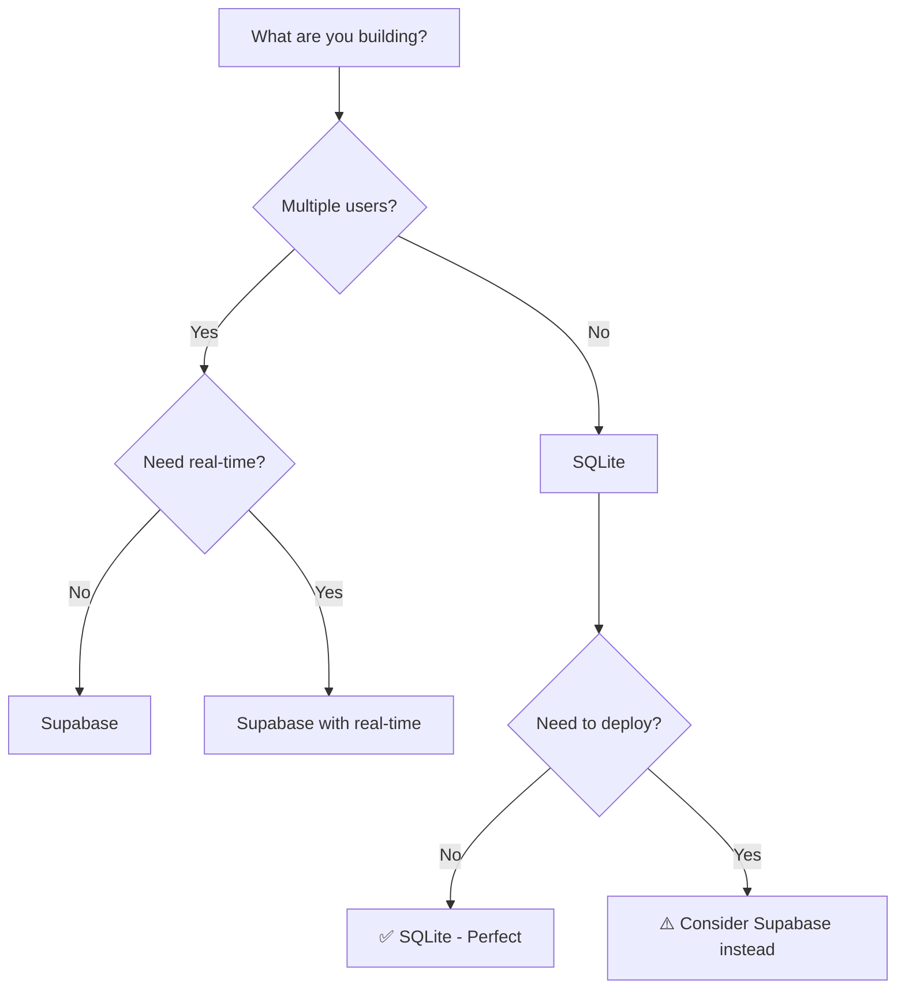

# Decision Guides Plan - AI-Friendly Knowledge Base

**Purpose:** Create decision guides that AI agents can reference when helping vibe coders navigate the overwhelming ecosystem

**Target:** Enable AI agents to provide confident, specific recommendations instead of "it depends" answers

**Timeline:** 1 week (can be done in parallel with integration primitives)

---

## 🎯 Core Insight

**TTA.dev's real value isn't just primitives - it's your codified knowledge of "what actually works"**

You've spent weeks/months discovering:
- Which tools are genuinely useful vs. sales traps
- Which "free tiers" are actually generous vs. bait-and-switch
- Which configurations work vs. break mysteriously
- Which approaches are beginner-friendly vs. expert-only

**This knowledge should be captured in AI-readable decision guides.**

---

## 📋 Decision Guides to Create

### 1. Database Selection Guide

**File:** `docs/decision-guides/database-selection.md`

**Structure:**
```markdown
# Database Selection Guide

> **For AI Agents:** Use this guide to recommend databases based on user's use case

## Quick Decision Tree



## Option 1: Supabase (Recommended for Multi-User Apps)

### When to Recommend
- Building chatbot with multiple users
- Need user authentication
- Want real-time features (live updates)
- Planning to deploy to production

### Pros
- ✅ **Free tier is generous:** 500MB database, 2GB bandwidth
- ✅ **Free tier is REAL:** Not a sales trap, genuinely useful for small apps
- ✅ **Built-in auth:** User accounts included
- ✅ **Real-time subscriptions:** Live updates without polling
- ✅ **PostgreSQL under the hood:** Can migrate if you outgrow it
- ✅ **Good documentation:** Easy to get started

### Cons
- ⚠️ **Requires internet:** Can't work offline
- ⚠️ **Requires signup:** Need to create account
- ⚠️ **Costs after free tier:** $25/month for more resources

### Cost Breakdown
- **Free tier:** 500MB database, 2GB bandwidth, 50K monthly active users
- **Realistic usage:** 10K chatbot conversations = ~50MB = well within free tier
- **When you'll pay:** >500MB data OR >2GB bandwidth OR >50K users
- **Paid tier:** $25/month for 8GB database, 50GB bandwidth

### Setup Difficulty
- **Time:** 10 minutes
- **Steps:** 
  1. Sign up at supabase.com
  2. Create project (2 minutes)
  3. Get URL and API key
  4. Add to environment variables
- **Gotchas:** None, it just works

### TTA.dev Integration
```python
from tta_dev_primitives.integrations import SupabasePrimitive

db = SupabasePrimitive()  # Reads from env vars
```

---

## Option 2: SQLite (Recommended for Solo/Local Apps)

### When to Recommend
- Building for yourself only
- Don't need multiple users
- Want to work offline
- Learning/prototyping

### Pros
- ✅ **Completely free:** No limits, no signup
- ✅ **Works offline:** Just a file on your computer
- ✅ **Simple setup:** No configuration needed
- ✅ **Fast:** No network latency
- ✅ **Portable:** Just copy the .db file

### Cons
- ⚠️ **Single-user only:** Can't scale to multiple users
- ⚠️ **No built-in auth:** You'd have to build it
- ⚠️ **No real-time:** Can't push updates to clients
- ⚠️ **Deployment complexity:** Need to handle file storage

### Cost Breakdown
- **Always free:** No costs ever

### Setup Difficulty
- **Time:** 2 minutes
- **Steps:**
  1. Install (included with Python)
  2. Create database file
- **Gotchas:** None

### TTA.dev Integration
```python
from tta_dev_primitives.integrations import SQLitePrimitive

db = SQLitePrimitive(db_path="chatbot.db")
```

---

## Option 3: PostgreSQL (For Advanced Users)

### When to Recommend
- Need full control over database
- Have specific PostgreSQL requirements
- Already familiar with PostgreSQL

### When NOT to Recommend
- Beginner (use Supabase instead - it's PostgreSQL with easier setup)
- Don't have specific reason to use raw PostgreSQL

### Pros
- ✅ **Full control:** Configure everything
- ✅ **Industry standard:** Widely used
- ✅ **Powerful features:** Advanced queries, extensions

### Cons
- ⚠️ **Complex setup:** Need to install, configure, manage
- ⚠️ **Requires hosting:** Need server to run it
- ⚠️ **Maintenance:** Backups, updates, security

### Recommendation
**Use Supabase instead** - it's PostgreSQL with easier setup and free hosting.

---

## Options to AVOID

### ❌ MongoDB
- **Why avoid:** Overkill for simple apps, different query language to learn
- **When it's okay:** If you specifically need document storage
- **Better alternative:** Supabase (supports JSON columns)

### ❌ Firebase
- **Why avoid:** Google's free tier is less generous, vendor lock-in
- **When it's okay:** If you're already in Google ecosystem
- **Better alternative:** Supabase (more generous free tier)

### ❌ MySQL
- **Why avoid:** PostgreSQL is better in almost every way
- **When it's okay:** If you specifically need MySQL compatibility
- **Better alternative:** PostgreSQL or Supabase

---

## AI Agent Response Templates

### User asks: "Which database should I use?"

**Template:**
```
I'll help you choose a database. Let me ask a few questions:

1. Are you building this for yourself only, or will other people use it?
2. Do you need it to work offline?
3. Do you need user accounts/authentication?

Based on your answers:
- **For yourself only + offline:** SQLite (simplest, free)
- **For multiple users:** Supabase (free tier is generous, includes auth)
- **For learning:** SQLite (no signup needed)

I recommend starting with [CHOICE] because [REASON].

Would you like me to help you set it up?
```

### User asks: "Is Supabase free?"

**Template:**
```
Yes! Supabase has a genuinely generous free tier:
- 500MB database storage
- 2GB bandwidth per month
- 50,000 monthly active users

For context, a chatbot with 10,000 conversations uses about 50MB of storage,
so you're well within the free tier.

The free tier is REAL - not a sales trap. You won't hit limits unless you're
building something with thousands of users.

If you do outgrow it, the paid tier is $25/month, which is reasonable.
```

### User asks: "Can I use MongoDB?"

**Template:**
```
You *can* use MongoDB, but I don't recommend it for your use case because:

1. MongoDB uses a different query language (you'd have to learn it)
2. It's overkill for a simple chatbot
3. The free tier is more limited (512MB vs Supabase's 500MB + more features)

Supabase is a better choice because:
- Uses SQL (easier to learn)
- More generous free tier
- Includes authentication built-in
- Supports JSON data (if you need document-style storage)

Would you like me to help you set up Supabase instead?
```
```

**Deliverable:** Complete decision guide with:
- Decision tree diagram
- Detailed pros/cons for each option
- Cost breakdowns
- Setup difficulty ratings
- AI agent response templates

---

### 2. LLM Provider Selection Guide

**File:** `docs/decision-guides/llm-provider-selection.md`

**Structure:** Similar to database guide, covering:
- OpenAI (GPT-4o-mini, GPT-4)
- Anthropic (Claude)
- Local (Ollama)
- When to avoid: Azure OpenAI, Google Gemini (for beginners)

**Key sections:**
- Cost per 1M tokens
- Quality comparisons
- Speed comparisons
- Free tier details
- Setup difficulty

---

### 3. Deployment Platform Selection Guide

**File:** `docs/decision-guides/deployment-platform-selection.md`

**Structure:** Similar format, covering:
- Railway (recommended for Python + database)
- Vercel (recommended for serverless)
- Fly.io (free tier option)
- When to avoid: AWS, DigitalOcean (for beginners)

---

### 4. Ecosystem Terminology Guide

**File:** `docs/decision-guides/ecosystem-terminology.md`

**Purpose:** Explain confusing terms that vibe coders encounter

**Sections:**
- Repository vs Workspace vs Environment
- Branch vs Fork vs Clone
- Local vs Remote
- Commit vs Push vs Pull
- Package vs Module vs Library
- API vs SDK vs Library
- Serverless vs Server vs Container

**Format:**
```markdown
## Repository vs Workspace vs Environment

### Repository (Repo)
**What it is:** A project folder that Git tracks

**Analogy:** Like a Google Drive folder, but for code

**Example:** `TTA.dev` is a repository

**Why it matters:** This is where your code lives

---

### Workspace (VS Code)
**What it is:** A collection of folders you're working on in VS Code

**Analogy:** Like having multiple browser tabs open

**Example:** You might have `TTA.dev` + `my-chatbot` in one workspace

**Why it matters:** Just a VS Code thing, doesn't affect your code

---

### Environment
**What it is:** A set of installed packages and Python version

**Analogy:** Like a separate computer for each project

**Example:** Your chatbot has OpenAI package, but TTA.dev doesn't

**Why it matters:** Prevents package conflicts between projects

---

### Quick Reference
- **Repo** = your project
- **Workspace** = what you see in VS Code
- **Environment** = which packages are installed
```

---

### 5. Package Manager Rationale Guide

**File:** `docs/decision-guides/why-uv-not-pip.md`

**Purpose:** Explain why TTA.dev uses uv instead of pip

**Sections:**
- Problems with pip
- Why uv is better
- Command comparison (pip → uv)
- "But I already know pip" response
- "Can I still use pip?" response

---

## 📊 Success Metrics

### Before Decision Guides

**AI Agent Response to "Which database should I use?":**
```
It depends on your use case. There are several options:
- Supabase
- PostgreSQL  
- SQLite
- MongoDB

Each has pros and cons. What are you trying to build?

[User gets frustrated, doesn't know how to answer]
```

### After Decision Guides

**AI Agent Response:**
```
I'll help you choose! Let me ask: are you building this for yourself only,
or will other people use it?

[User: "Just for myself"]

Perfect! I recommend SQLite because:
- Completely free, no signup needed
- Works offline
- Simple setup (2 minutes)
- Perfect for solo projects

It's already included with Python, so you're ready to go. Would you like
me to help you set it up?
```

**Improvement:** Confident, specific recommendation instead of "it depends"

---

## 🎯 Implementation Plan

### Week 1: Create Decision Guides

**Day 1:** Database Selection Guide
- Decision tree
- Supabase, SQLite, PostgreSQL details
- Cost breakdowns
- AI response templates

**Day 2:** LLM Provider Selection Guide
- OpenAI, Anthropic, Ollama details
- Cost per token comparisons
- Quality/speed comparisons
- AI response templates

**Day 3:** Deployment Platform Selection Guide
- Railway, Vercel, Fly.io details
- Cost comparisons
- Setup difficulty ratings
- AI response templates

**Day 4:** Ecosystem Terminology Guide
- Repo/workspace/environment
- Git terminology
- Package terminology
- AI explanation templates

**Day 5:** Package Manager Rationale Guide
- Why uv not pip
- Command comparisons
- Migration guide
- FAQ responses

---

## 🤖 AI Agent Integration

### Copilot Toolset

Create `#tta-decision-guides` toolset:

```json
{
  "name": "tta-decision-guides",
  "description": "Decision guides for helping users choose databases, LLMs, deployment platforms",
  "tools": [
    {
      "name": "database-selection",
      "path": "docs/decision-guides/database-selection.md"
    },
    {
      "name": "llm-provider-selection",
      "path": "docs/decision-guides/llm-provider-selection.md"
    },
    {
      "name": "deployment-platform-selection",
      "path": "docs/decision-guides/deployment-platform-selection.md"
    }
  ]
}
```

### Cline Instructions

Add to `.cline/instructions.md`:

```markdown
## Decision Guidance

When user asks "which [database/LLM/deployment platform] should I use?":

1. Reference the appropriate decision guide in `docs/decision-guides/`
2. Ask clarifying questions from the decision tree
3. Provide specific recommendation with reasoning
4. Offer to help with setup

Do NOT say "it depends" without providing specific guidance.
```

### Claude Instructions

Add to `CLAUDE.md`:

```markdown
## Decision Guidance

TTA.dev includes decision guides in `docs/decision-guides/` that contain:
- Vetted recommendations based on real experience
- Cost breakdowns and free tier details
- Setup difficulty ratings
- "Avoid this" warnings for sales traps

When helping users choose tools, reference these guides to provide confident,
specific recommendations instead of generic "it depends" answers.
```

---

## 📈 Expected Impact

### Current State (Dimension 3 Score: 3/100)
- AI agents say "it depends" → user gets frustrated
- No guidance on which tools to use
- No cost/complexity comparisons
- Users hit walls choosing wrong tools

### After Decision Guides (Target: 85/100)
- AI agents provide confident recommendations
- Clear decision trees for common choices
- Cost and complexity clearly explained
- Users choose right tools first time

**Improvement:** +82 points on Decision Guidance dimension

---

## 🎯 Definition of Done

**A vibe coder can ask an AI agent:**
- "Which database should I use?" → Get specific recommendation in <1 minute
- "Is Supabase free?" → Get accurate cost breakdown
- "Should I use MongoDB?" → Get clear "no, use Supabase instead" with reasoning
- "How do I deploy this?" → Get platform recommendation based on their needs
- "What's the difference between a repo and workspace?" → Get clear explanation

**When this works, Decision Guidance score = 85/100**

---

**Last Updated:** October 30, 2025  
**Timeline:** 1 week (5 days)  
**Can be done in parallel with:** Integration primitives development

