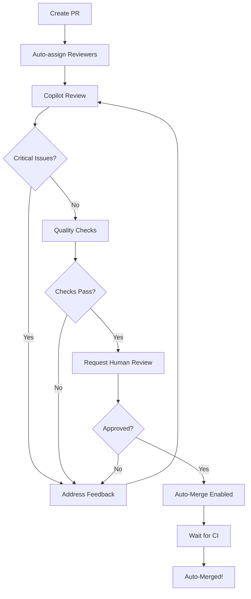

# [[TTA/Workflows/PR Automation Guide]]

This guide explains how to use TTA's automated PR review and merge system powered by GitHub Copilot.

## 🎯 Overview

The TTA repository uses GitHub Copilot for automated code reviews and has workflows for:
- **Auto-assigning reviewers** based on file changes
- **Automated Copilot code review** with quality checks
- **Auto-merging PRs** when criteria are met
- **CLI tools** for managing PRs efficiently

## 🚀 Quick Start

### Using the CLI Tool

```bash
# List all open PRs
./scripts/pr-manager.sh list

# View PR details
./scripts/pr-manager.sh details 73

# Approve a PR
./scripts/pr-manager.sh approve 73 "LGTM! ✅"

# Enable auto-merge
./scripts/pr-manager.sh automerge 73

# Check Copilot review status
./scripts/pr-manager.sh copilot 73

# Bulk approve all ready PRs
./scripts/pr-manager.sh bulk-approve

# Watch PR status in real-time
./scripts/pr-manager.sh watch 73 30
```

## 📋 Automated Workflows

### 1. Auto-Assign Reviewers

**Trigger**: When PR is opened or marked ready for review

**Process**:
1. Reads `.github/CODEOWNERS` to find code owners
2. Analyzes changed files to determine expertise needed
3. Assigns relevant reviewers automatically
4. Adds appropriate labels (backend, frontend, testing, etc.)

**CODEOWNERS Configuration**:
```
# Backend code
*.py @theinterneti
/src/** @theinterneti

# Frontend code
*.ts @theinterneti
*.tsx @theinterneti

# Infrastructure
Dockerfile* @theinterneti
docker-compose*.yml @theinterneti
```

### 2. Copilot Code Review

**Trigger**: When PR is opened or updated

**Process**:
1. Waits for GitHub Copilot to complete review (up to 5 minutes)
2. Analyzes Copilot review comments
3. Categorizes comments (critical, security, etc.)
4. Posts summary comment on PR
5. Fails check if critical issues found

**Example Output**:
```
🤖 Copilot Review Summary

Total Comments: 5
Unresolved: 3
Critical: 1

⚠️ Critical Issues
- test_timeout_primitive.py:19 - Modifying __class__.__name__ affects all instances...
```

### 3. Quality Gate Checks

**Trigger**: On every PR update

**Checks**:
- ✅ Ruff linting (code style)
- ✅ Ruff formatting
- ✅ Pyright type checking
- ✅ Test coverage (≥70% required)

**Coverage Report**:
```
✅ Code Coverage Report

Current Coverage: 82.45%
Required: 70%

✅ Coverage threshold met!
```

### 4. Auto-Merge

**Trigger**: When all criteria are met

**Criteria**:
- ✅ At least 1 approval
- ✅ No change requests
- ✅ All Copilot comments resolved
- ✅ All CI checks passing

**Merge Strategy**: Squash merge with branch deletion

## 🔧 Configuration

### Enable Auto-Merge for Repository

1. Go to **Settings** > **General**
2. Scroll to **Pull Requests**
3. Enable:
   - ✅ Allow squash merging
   - ✅ Allow auto-merge
   - ✅ Automatically delete head branches

### Branch Protection Rules

Configure for `main` branch:

1. **Settings** > **Branches** > **Branch protection rules**
2. Add rule for `main`:
   ```
   ✅ Require a pull request before merging
   ✅ Require approvals (1)
   ✅ Require status checks to pass
      - Quality Gate Checks
      - Copilot Code Review
   ✅ Require branches to be up to date
   ✅ Do not allow bypassing the above settings
   ```

### GitHub Copilot Settings

1. **Settings** > **Code security and analysis**
2. Enable **GitHub Copilot** for:
   - ✅ Pull request reviews
   - ✅ Code suggestions
   - ✅ Security scanning

## 📊 PR Workflow

### Standard PR Lifecycle



### Example: Handling PR #73

**Current Status** (from your PR):
```
Title: feat: Phase 2 Async OpenHands Integration
Status: Open
Copilot Comments: 5 (3 unresolved)
Reviews: Not yet approved
```

**Steps to Merge**:

1. **Address Copilot Comments**:
```bash
# Check Copilot feedback
./scripts/pr-manager.sh copilot 73

# Fix issues identified
# - MockPrimitive __class__.__name__ modification
# - asyncio.run() event loop handling
# - OpenTelemetry dependency documentation
```

2. **Push Fixes**:
```bash
git add .
git commit -m "fix: address Copilot review feedback"
git push
```

3. **Verify Quality Gates**:
```bash
# Wait for workflows to complete
./scripts/pr-manager.sh watch 73

# Or check manually
./scripts/pr-manager.sh workflow 73
```

4. **Get Approval**:
```bash
# Self-review if you're the maintainer
gh pr review 73 --approve --body "Copilot feedback addressed, all checks passing ✅"

# Or request review
gh pr edit 73 --add-reviewer @theinterneti
```

5. **Enable Auto-Merge**:
```bash
./scripts/pr-manager.sh automerge 73
```

## 🎓 Best Practices

### Writing Copilot-Friendly Code

1. **Use Type Hints**:
```python
# ✅ Good - Copilot can analyze types
def process_data(input: dict[str, Any]) -> Result:
    ...

# ❌ Bad - No type information
def process_data(input):
    ...
```

2. **Write Clear Docstrings**:
```python
# ✅ Good - Clear documentation
def calculate_timeout(delay: float, grace: float) -> float:
    """Calculate total timeout duration.

    Args:
        delay: Base delay in seconds
        grace: Additional grace period

    Returns:
        Total timeout duration
    """
```

3. **Follow SOLID Principles**:
- Copilot reviews are more positive for well-structured code
- Small, focused functions get better reviews
- Clear separation of concerns reduces comments

### Responding to Copilot Comments

**Critical Issues** (must fix):
- Security vulnerabilities
- Type errors
- Resource leaks
- Race conditions

**Suggestions** (consider):
- Code style improvements
- Documentation enhancements
- Optimization opportunities

**False Positives** (can dismiss):
- Add comment explaining why suggestion doesn't apply
- Use `<!-- copilot-ignore -->` if needed
- Provide context in PR description

## 🛠️ Troubleshooting

### Workflow Not Running

**Check**:
```bash
# View workflow runs
gh run list --workflow=pr-automation.yml

# Check workflow file syntax
yamllint .github/workflows/pr-automation.yml
```

**Fix**: Ensure workflow file is valid YAML and permissions are set

### Auto-Merge Not Working

**Check criteria**:
```bash
./scripts/pr-manager.sh details 73
```

**Common issues**:
- Missing approvals
- Unresolved Copilot comments
- Failing CI checks
- Branch not up to date

**Fix**:
```bash
# Update branch
git pull origin main
git push

# Re-enable auto-merge
./scripts/pr-manager.sh automerge 73
```

### Copilot Not Reviewing

**Check**:
1. Go to PR > Files changed
2. Look for Copilot badge in header
3. Wait 2-3 minutes for review to complete

**If still missing**:
- Ensure Copilot is enabled for repository
- Check repository settings > Code security
- Re-open PR or push empty commit to trigger

## 📚 Advanced Features

### Custom Review Rules

Edit `.github/workflows/pr-automation.yml`:

```yaml
# Add custom quality gates
- name: Custom quality check
  run: |
    # Your custom checks
    uv run python scripts/custom-checks.py
```

### Slack/Discord Notifications

Add notification step:

```yaml
- name: Notify on merge
  if: github.event.pull_request.merged == true
  uses: slackapi/slack-github-action@v1
  with:
    webhook-url: ${{ secrets.SLACK_WEBHOOK }}
    payload: |
      {
        "text": "✅ PR #${{ github.event.number }} merged!"
      }
```

### Auto-Label PRs

Already configured! Labels added based on:
- `backend` - Python files changed
- `frontend` - TypeScript files changed
- `testing` - Test files changed
- `infrastructure` - Docker/CI files changed
- `documentation` - Markdown files changed

## 📖 CLI Reference

### Full Command List

```bash
# Listing and viewing
./scripts/pr-manager.sh list                    # List all open PRs
./scripts/pr-manager.sh details <pr>            # Show PR details

# Reviewing
./scripts/pr-manager.sh approve <pr> [msg]      # Approve PR
./scripts/pr-manager.sh changes <pr> [msg]      # Request changes
./scripts/pr-manager.sh copilot <pr>            # Check Copilot review

# Merging
./scripts/pr-manager.sh automerge <pr>          # Enable auto-merge
./scripts/pr-manager.sh disable-auto <pr>       # Disable auto-merge
./scripts/pr-manager.sh merge <pr> [method]     # Merge immediately

# Monitoring
./scripts/pr-manager.sh watch <pr> [interval]   # Watch PR status
./scripts/pr-manager.sh workflow <pr>           # Show workflow runs

# Bulk operations
./scripts/pr-manager.sh bulk-approve            # Approve all ready PRs
```

## 🔗 Resources

- [GitHub Copilot Docs](https://docs.github.com/en/copilot)
- [GitHub CLI Docs](https://cli.github.com/)
- [Branch Protection Rules](https://docs.github.com/en/repositories/configuring-branches-and-merges-in-your-repository/managing-protected-branches/about-protected-branches)
- [Auto-Merge Docs](https://docs.github.com/en/pull-requests/collaborating-with-pull-requests/incorporating-changes-from-a-pull-request/automatically-merging-a-pull-request)

---

**Last Updated**: 2025-10-27
**Status**: Active automation for TTA repository


---
**Logseq:** [[TTA.dev/Platform_tta_dev/Components/Augment/Core/Kb/Tta___workflows___docs development pr automation guide document]]
