# Database Selection Guide

**For AI Agents & Developers:** Use this guide to choose between SupabasePrimitive and SQLitePrimitive

---

## 🎯 Quick Decision Tree

```mermaid
graph TD
    A[What are you building?] --> B{Multiple users?}
    B -->|No| C[SQLitePrimitive]
    B -->|Yes| D{Need real-time updates?}
    D -->|No| E[SupabasePrimitive]
    D -->|Yes| F[SupabasePrimitive with real-time]
    
    C --> G{Need to deploy?}
    G -->|No| H[✅ SQLitePrimitive - Perfect]
    G -->|Yes| I[⚠️ Consider SupabasePrimitive instead]
    
    E --> J{Budget?}
    J -->|Free tier OK| K[✅ SupabasePrimitive - Start free]
    J -->|Need more| L[✅ SupabasePrimitive - Paid plan]
```



---

## 📊 Comparison Table

| Feature | SQLitePrimitive | SupabasePrimitive |
|---------|----------------|-------------------|
| **Best For** | Local apps, prototypes, single-user | Multi-user apps, production, cloud |
| **Setup Difficulty** | ⭐ Easy (no config) | ⭐⭐ Medium (API keys) |
| **Cost** | 💰 Free (always) | 💰 Free tier → Paid |
| **Deployment** | ⚠️ Complex (file-based) | ✅ Easy (cloud-hosted) |
| **Real-time** | ❌ No | ✅ Yes |
| **Multi-user** | ❌ No (file locks) | ✅ Yes |
| **Scalability** | ⚠️ Limited | ✅ Excellent |
| **Privacy** | ✅ 100% local | ⚠️ Cloud-hosted |
| **Backup** | ⚠️ Manual | ✅ Automatic |

---

## 🟢 Use SQLitePrimitive When...

### ✅ Perfect For

1. **Local-only applications**
   - Desktop apps
   - CLI tools
   - Personal projects

2. **Prototyping & learning**
   - Testing database concepts
   - Building MVPs
   - Learning SQL

3. **Single-user scenarios**
   - Personal task manager
   - Local cache
   - Development database

4. **Privacy-critical data**
   - Medical records
   - Financial data
   - Personal journals

### ⚠️ Avoid When

- Multiple users need concurrent access
- You need to deploy to production
- Real-time updates are required
- You need automatic backups

---

## 🔵 Use SupabasePrimitive When...

### ✅ Perfect For

1. **Multi-user applications**
   - SaaS products
   - Team collaboration tools
   - Social apps

2. **Production deployments**
   - Cloud-hosted apps
   - Mobile backends
   - Web applications

3. **Real-time features**
   - Chat applications
   - Live dashboards
   - Collaborative editing

4. **Scalable systems**
   - Growing user base
   - High traffic
   - Global distribution

### ⚠️ Avoid When

- You need 100% local data
- Free tier limits are too restrictive
- You're just prototyping locally

---

## 💻 Code Examples

### SQLitePrimitive - Local Task Manager

```python
"""Local task manager using SQLitePrimitive"""

from tta_dev_primitives.integrations import SQLitePrimitive, SQLiteRequest
from tta_dev_primitives.core.base import WorkflowContext
import asyncio

async def main():
    # Create primitive (uses local file)
    db = SQLitePrimitive(database="tasks.db")
    context = WorkflowContext(workflow_id="task-manager")
    
    # Create table
    create_table = SQLiteRequest(
        query="""
        CREATE TABLE IF NOT EXISTS tasks (
            id INTEGER PRIMARY KEY AUTOINCREMENT,
            title TEXT NOT NULL,
            completed BOOLEAN DEFAULT 0,
            created_at TIMESTAMP DEFAULT CURRENT_TIMESTAMP
        )
        """,
        fetch="none"
    )
    await db.execute(create_table, context)
    
    # Add task
    add_task = SQLiteRequest(
        query="INSERT INTO tasks (title) VALUES (?)",
        parameters=("Build my first app",),
        fetch="none"
    )
    await db.execute(add_task, context)
    
    # Get all tasks
    get_tasks = SQLiteRequest(
        query="SELECT * FROM tasks ORDER BY created_at DESC",
        fetch="all"
    )
    response = await db.execute(get_tasks, context)
    
    print(f"Tasks: {response.data}")

if __name__ == "__main__":
    asyncio.run(main())
```

**When to use:** Personal task manager, no deployment needed, 100% local.

---

### SupabasePrimitive - Team Collaboration

```python
"""Team task manager using SupabasePrimitive"""

from tta_dev_primitives.integrations import SupabasePrimitive, SupabaseRequest
from tta_dev_primitives.core.base import WorkflowContext
import asyncio
import os

async def main():
    # Create primitive (uses cloud database)
    db = SupabasePrimitive(
        url=os.getenv("SUPABASE_URL"),
        key=os.getenv("SUPABASE_KEY")
    )
    context = WorkflowContext(workflow_id="team-tasks")
    
    # Add task (table already exists in Supabase)
    add_task = SupabaseRequest(
        operation="insert",
        table="tasks",
        data={
            "title": "Review PR #123",
            "assigned_to": "alice@example.com",
            "team_id": "team-001"
        }
    )
    await db.execute(add_task, context)
    
    # Get team's tasks
    get_tasks = SupabaseRequest(
        operation="select",
        table="tasks",
        filters={"team_id": {"eq": "team-001"}},
        columns="id,title,assigned_to,completed"
    )
    response = await db.execute(get_tasks, context)
    
    print(f"Team tasks: {response.data}")
    
    # Update task status
    update_task = SupabaseRequest(
        operation="update",
        table="tasks",
        data={"completed": True},
        filters={"id": {"eq": 1}}
    )
    await db.execute(update_task, context)

if __name__ == "__main__":
    asyncio.run(main())
```

**When to use:** Team collaboration, cloud deployment, real-time updates.

---

## 🚀 Migration Path

### Starting Local → Moving to Cloud

**Phase 1: Prototype with SQLite**
```python
# Start with SQLitePrimitive for rapid prototyping
db = SQLitePrimitive(database="prototype.db")
```

**Phase 2: Migrate to Supabase**
```python
# Switch to SupabasePrimitive when ready to deploy
db = SupabasePrimitive(url=SUPABASE_URL, key=SUPABASE_KEY)
```

**Migration steps:**
1. Export SQLite data: `sqlite3 prototype.db .dump > data.sql`
2. Create Supabase project: https://supabase.com/dashboard
3. Import schema and data via Supabase SQL editor
4. Update code to use SupabasePrimitive
5. Test with production data

---

## 💰 Cost Breakdown

### SQLitePrimitive
- **Setup:** $0
- **Monthly:** $0
- **Storage:** Limited by disk space
- **Scaling:** Manual (buy bigger disk)

### SupabasePrimitive
- **Free Tier:** 500MB database, 2GB bandwidth/month
- **Pro Plan:** $25/month (8GB database, 50GB bandwidth)
- **Team Plan:** $599/month (unlimited)
- **Scaling:** Automatic

**Recommendation:** Start with Supabase free tier, upgrade when needed.

---

## 🔒 Security Considerations

### SQLitePrimitive
- ✅ Data stays on your machine
- ✅ No network exposure
- ⚠️ No built-in encryption
- ⚠️ Manual backups required

### SupabasePrimitive
- ✅ Built-in Row Level Security (RLS)
- ✅ Automatic backups
- ✅ SSL/TLS encryption
- ⚠️ Data in cloud (check compliance)

---

## 📚 Related Documentation

- **SQLitePrimitive API:** [`packages/tta-dev-primitives/src/tta_dev_primitives/integrations/sqlite_primitive.py`](../../packages/tta-dev-primitives/src/tta_dev_primitives/integrations/sqlite_primitive.py)
- **SupabasePrimitive API:** [`packages/tta-dev-primitives/src/tta_dev_primitives/integrations/supabase_primitive.py`](../../packages/tta-dev-primitives/src/tta_dev_primitives/integrations/supabase_primitive.py)
- **Integration Tests:** [`packages/tta-dev-primitives/tests/test_integrations.py`](../../packages/tta-dev-primitives/tests/test_integrations.py)
- **Primitives Catalog:** [`PRIMITIVES_CATALOG.md`](../../PRIMITIVES_CATALOG.md)

---

**Last Updated:** October 30, 2025  
**For:** AI Agents & Developers (all skill levels)  
**Maintained by:** TTA.dev Team

