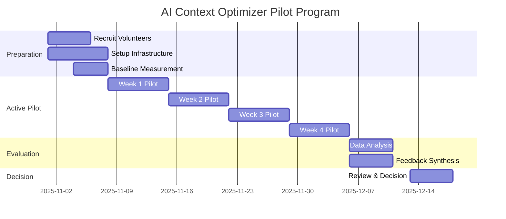

# AI Context Optimizer Pilot Program

**Status**: Planning Phase  
**Start Date**: TBD  
**Duration**: 4-6 weeks  
**Owner**: TTA.dev Team

---

## Overview

The AI Context Optimizer pilot program aims to evaluate the effectiveness of context optimization techniques for AI-powered development workflows. This program will test token reduction strategies while maintaining or improving developer productivity and satisfaction.

## Objectives

### Primary Goals

1. **Reduce Token Consumption**: Achieve 20-40% reduction in token usage across typical development workflows
2. **Maintain Developer Velocity**: Ensure no negative impact on development speed
3. **Preserve Code Quality**: Maintain or improve code quality metrics
4. **Enhance Developer Experience**: Improve satisfaction with AI interactions

### Secondary Goals

1. Identify optimal context optimization patterns
2. Establish best practices for context management
3. Create reusable optimization templates
4. Build metrics dashboard for monitoring

---

## Program Structure

### Phase 1: Preparation (Week 1)

- [ ] Recruit pilot volunteers
- [ ] Baseline measurement collection
- [ ] Setup tracking infrastructure
- [ ] Distribute optimization guidelines

### Phase 2: Active Pilot (Weeks 2-4)

- [ ] Deploy context optimizer to pilot group
- [ ] Weekly check-ins and feedback sessions
- [ ] Continuous metric collection
- [ ] Issue tracking and resolution

### Phase 3: Evaluation (Week 5)

- [ ] Analyze collected metrics
- [ ] Synthesize feedback
- [ ] Compare baseline vs. pilot performance
- [ ] Identify optimization patterns

### Phase 4: Decision (Week 6)

- [ ] Review findings with stakeholders
- [ ] Make go/no-go decision
- [ ] Plan rollout strategy (if go)
- [ ] Document lessons learned

---

## Success Criteria

### Quantitative Metrics

| Metric | Baseline | Target | Threshold |
|--------|----------|--------|-----------|
| Token Reduction | 0% | 30% | 20% |
| Response Time | Current | -10% | +0% |
| Task Completion Rate | Current | +5% | -0% |
| Code Quality Score | Current | +0% | -5% |

### Qualitative Metrics

- Developer satisfaction score: ≥ 4.0/5.0
- Perceived productivity improvement: ≥ 60% positive
- Willingness to continue using: ≥ 70%
- Would recommend to peers: ≥ 65%

---

## Participant Requirements

### Ideal Volunteers

- Active daily users of AI coding assistants (Claude, Copilot, Augment)
- Comfortable with Python and/or JavaScript
- Working on TTA.dev or related projects
- Available for weekly 15-minute check-ins
- Can commit to 4-6 week participation

### Expected Time Commitment

- **Initial Setup**: 30 minutes
- **Weekly Check-ins**: 15 minutes
- **Daily Usage**: Normal development work (no additional time)
- **Final Survey**: 20 minutes

**Total**: ~2-3 hours over 4-6 weeks

---

## Resources

- [Volunteer Selection Criteria](volunteer-criteria.md)
- [Success Metrics Definition](success-metrics.md)
- [Feedback Collection Template](feedback-template.md)
- [Rollout Decision Framework](rollout-decision.md)

---

## Key Contacts

- **Program Manager**: TBD
- **Technical Lead**: TBD
- **Data Analyst**: TBD

---

## Timeline

---

## Questions?

For questions about the pilot program, please:

1. Check the [FAQ section](#faq) below
2. Review related documentation in this directory
3. Create an issue in the [TTA.dev repository](https://github.com/theinterneti/TTA.dev/issues)
4. Contact the program team

---

## FAQ

### Q: How much time will this require?

**A**: Approximately 2-3 hours total over 4-6 weeks, mostly for check-ins and surveys. Daily usage is part of your normal development work.

### Q: What if I can't complete the full pilot?

**A**: That's okay! Any participation helps. We'll collect data for as long as you can participate.

### Q: Will this slow down my development?

**A**: No. The optimizer is designed to maintain or improve development velocity while reducing token consumption.

### Q: What data will be collected?

**A**: Token usage metrics, response times, and satisfaction surveys. No code or personal data is collected.

### Q: Can I opt out at any time?

**A**: Yes, participation is completely voluntary and you can opt out at any time.

---

**Last Updated**: 2025-10-29  
**Version**: 1.0.0
