# GitHub Actions Workflow Architecture Diagram

## Current State (The Problem)

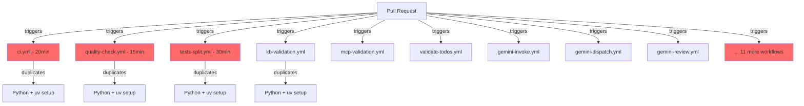

**Problems:**

- 20 workflow files
- Setup code duplicated 20 times
- Overlapping triggers
- Unclear responsibilities
- Slow, confusing feedback

---

## Proposed Architecture (The Solution)

### High-Level Flow

```mermaid
graph TD
    PR[Pull Request] --> |fast validation| PRV[pr-validation.yml<br/>~10 min]

    PRV --> Lint[Lint & Format<br/>2 min]
    PRV --> Type[Type Check<br/>3 min]
    PRV --> Unit[Unit Tests<br/>5 min]
    PRV --> Docs[Docs Check<br/>1 min]

    Lint --> Gate{All Pass?}
    Type --> Gate
    Unit --> Gate
    Docs --> Gate

    Gate -->|Yes| Merge[Merge to main]
    Gate -->|No| Block[❌ Block PR]

    Merge --> MV[merge-validation.yml<br/>~30 min]

    MV --> Integration[Integration Tests<br/>10 min]
    MV --> CrossPlatform[Cross-Platform<br/>20 min]
    MV --> Coverage[Coverage Report]
    MV --> Install[Package Install Test]

    style PRV fill:#51cf66
    style MV fill:#4dabf7
    style Gate fill:#ffd43b
```

### Component Architecture

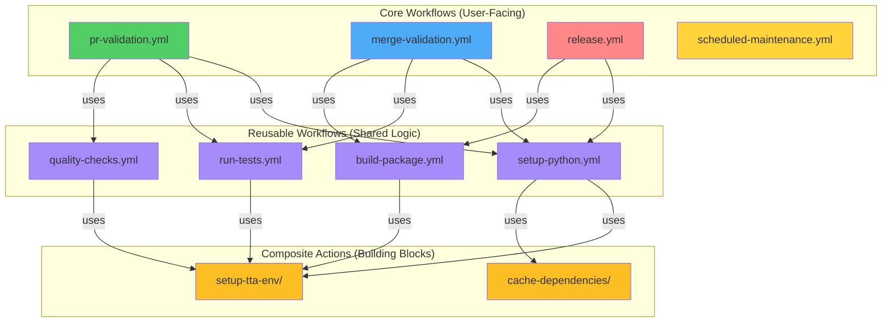

### Detailed PR Validation Flow

```mermaid
sequenceDiagram
    participant Dev as Developer
    participant GH as GitHub
    participant PRV as pr-validation.yml
    participant Lint as Lint Job
    participant Type as Type Job
    participant Unit as Unit Job
    participant Docs as Docs Job
    participant Gate as PR Gate Job

    Dev->>GH: Open PR
    GH->>PRV: Trigger workflow

    par Run in parallel
        PRV->>Lint: Run ruff format + check
        PRV->>Type: Run pyright
        PRV->>Unit: Run pytest (unit only)
        PRV->>Docs: Check markdown
    end

    Lint-->>Gate: ✅ Pass (2min)
    Type-->>Gate: ✅ Pass (3min)
    Unit-->>Gate: ✅ Pass (5min)
    Docs-->>Gate: ✅ Pass (1min)

    Gate->>GH: ✅ All checks passed
    GH->>Dev: Ready to merge!

    Note over PRV,Gate: Total time: ~10 minutes
```

### Dependency Flow

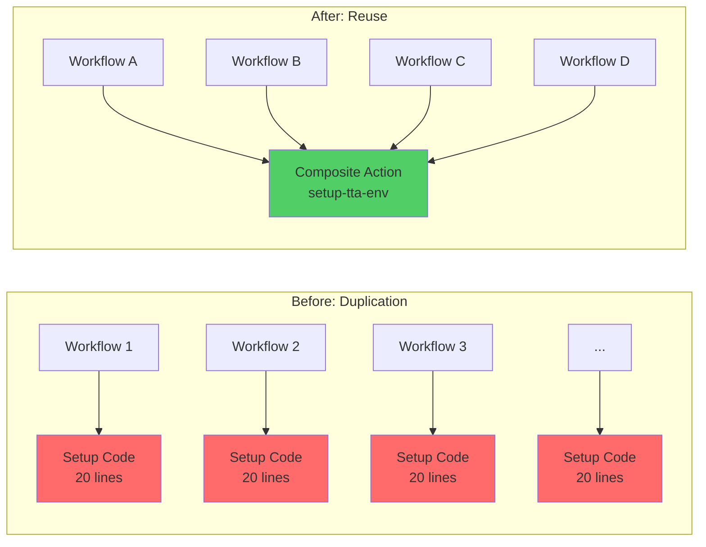

---

## Workflow Responsibilities

### pr-validation.yml (Fast Gate)

```mermaid
graph LR
    A[PR Created] --> B{Changed files<br/>in packages/?}
    B -->|Yes| C[Run Validation]
    B -->|No| D[Skip]

    C --> E[Lint & Format<br/>ruff]
    C --> F[Type Check<br/>pyright]
    C --> G[Unit Tests<br/>pytest]
    C --> H[Docs Check<br/>markdown]

    E --> I{All Pass?}
    F --> I
    G --> I
    H --> I

    I -->|Yes| J[✅ Approve PR]
    I -->|No| K[❌ Block PR]

    style C fill:#51cf66
    style J fill:#51cf66
    style K fill:#ff6b6b
```

**Purpose**: Fast feedback (10 min)
**Strategy**: Fail fast, single OS, latest Python
**When**: Every PR

### merge-validation.yml (Thorough Check)

```mermaid
graph LR
    A[Merged to main] --> B[Run Full Suite]

    B --> C[Integration Tests<br/>Docker services]
    B --> D[Cross-Platform<br/>3 OS × 2 Python]
    B --> E[Coverage Report<br/>Codecov]
    B --> F[Package Install<br/>Clean env]

    C --> G{All Pass?}
    D --> G
    E --> G
    F --> G

    G -->|Yes| H[✅ Main is healthy]
    G -->|No| I[❌ Alert team]

    style B fill:#4dabf7
    style H fill:#51cf66
    style I fill:#ff6b6b
```

**Purpose**: Comprehensive validation (30 min)
**Strategy**: Everything, all platforms
**When**: After merge to main

### release.yml (Automation)

```mermaid
graph LR
    A[Tag pushed<br/>v*] --> B[Build Package]
    A2[Manual trigger] --> B

    B --> C[Run Tests]
    C --> D{Tests Pass?}
    D -->|Yes| E[Build Distributions]
    D -->|No| F[❌ Abort]

    E --> G[Test Install<br/>Clean env]
    G --> H{Install OK?}
    H -->|Yes| I[Publish to PyPI]
    H -->|No| F

    I --> J[Create GitHub Release]
    J --> K[✅ Released!]

    style B fill:#ff8787
    style K fill:#51cf66
    style F fill:#ff6b6b
```

**Purpose**: Automated releases
**Strategy**: Manual trigger or tag push
**When**: Ready to release

### scheduled-maintenance.yml (Background)

```mermaid
graph LR
    A[Nightly Cron<br/>2 AM UTC] --> B[Dependency Audit]
    A --> C[Link Checker]
    A --> D[Cleanup Artifacts]

    A2[Weekly Cron<br/>Monday 10 AM] --> E[Performance Benchmarks]

    B --> F[Report]
    C --> F
    D --> F
    E --> F

    F --> G{Issues Found?}
    G -->|Yes| H[Create Issue]
    G -->|No| I[✅ All good]

    style A fill:#ffd43b
    style A2 fill:#ffd43b
    style I fill:#51cf66
```

**Purpose**: Maintenance tasks
**Strategy**: Scheduled, non-blocking
**When**: Nightly/weekly

---

## Composite Action Flow

### setup-tta-env

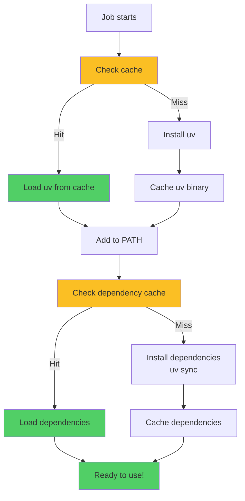

**Benefits**:

- Faster runs (cache hit ~2 min vs cold ~5 min)
- Consistent setup across all workflows
- Update in 1 place

---

## Comparison: Timeline

### Before (Current)

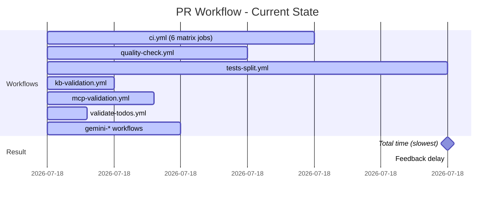

### After (Proposed)

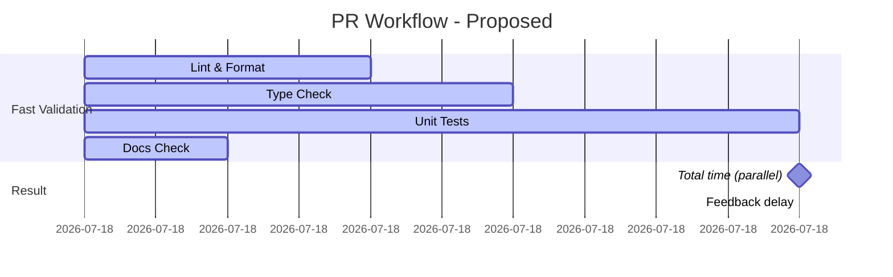

**Improvement**: 30 min → 10 min (3x faster!)

---

## Reusable Workflow Pattern

### Example: run-tests.yml

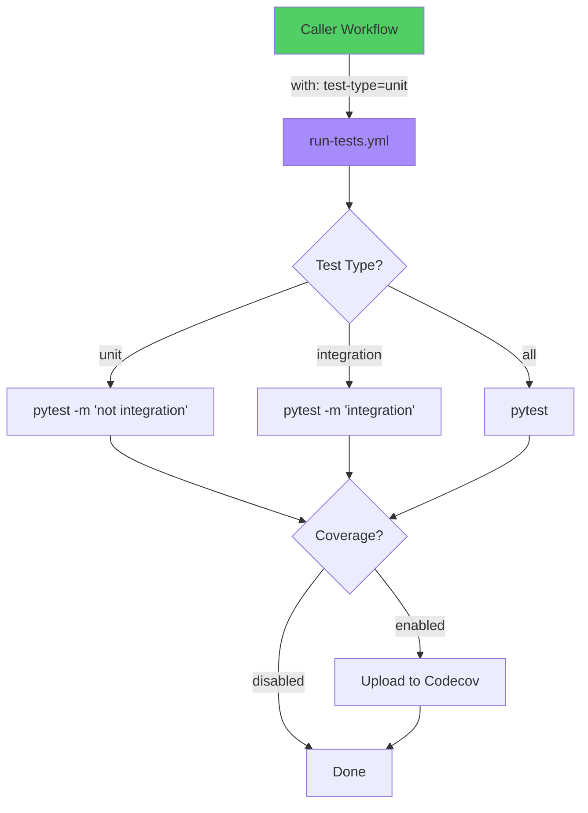

**Usage**:

```yaml
# In pr-validation.yml
jobs:
  unit-tests:
    uses: ./.github/workflows-reusable/run-tests.yml
    with:
      test-type: unit
      coverage: false

# In merge-validation.yml
jobs:
  integration-tests:
    uses: ./.github/workflows-reusable/run-tests.yml
    with:
      test-type: integration
      coverage: true
```

---

## Migration Strategy

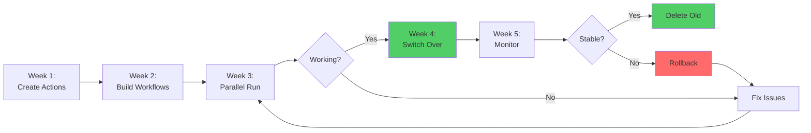

---

## Success Metrics

```mermaid
graph LR
    subgraph "Speed"
        A1[PR Validation<br/>30min → 10min]
        A2[Feedback Loop<br/>Fast & Clear]
    end

    subgraph "Maintainability"
        B1[Update uv<br/>10 files → 1 file]
        B2[Add Check<br/>Easy reuse]
    end

    subgraph "Clarity"
        C1[Workflow Purpose<br/>Obvious from name]
        C2[Job Dependencies<br/>Explicit flow]
    end

    A1 --> D[Better DX]
    A2 --> D
    B1 --> D
    B2 --> D
    C1 --> D
    C2 --> D

    style D fill:#51cf66
```

---

**Legend**:

- 🟢 Green: New/Good
- 🔵 Blue: Shared/Reusable
- 🟡 Yellow: Decision Point
- 🔴 Red: Problem/Old

**Full Documentation**: See [`WORKFLOW_REBUILD_PLAN.md`](./WORKFLOW_REBUILD_PLAN.md)
