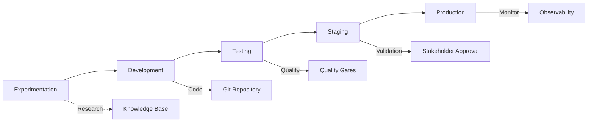

# TTA.dev DevOps Studio Architecture

component-type:: architecture
tech-stack:: kubernetes, docker, prometheus, grafana, terraform, ansible
stage:: all-stages
complexity:: advanced
related:: [[TTA.dev/Architecture]], [[TTA.dev/Observability]], [[TTA.dev/CI-CD Pipeline]]

Complete studio architecture for AI-native development operations

---

## 🏗️ Studio Overview

The TTA.dev DevOps Studio provides a complete production-ready infrastructure for AI-native application development, deployment, and operations.

### Core Philosophy

- **Infrastructure as Code** - Everything versioned and repeatable
- **Observability First** - Built-in monitoring, tracing, and alerting  
- **Security by Design** - Security integrated at every layer
- **Scalable by Default** - Designed for production workloads
- **Developer Experience** - Optimized for AI agent workflows

---

## 🧱 Architecture Components

### 1. Development Layer

**Purpose:** Local and remote development environments

**Components:**

- **VS Code + Extensions** - AI agent optimized IDE
- **MCP Servers** - Model Context Protocol integrations
- **E2B Sandboxes** - Secure code execution environments
- **Local Observability** - Development tracing and metrics

**Integration Points:**

- [[TTA.dev/MCP/Integration]] - Tool connectivity
- [[TTA.dev/Packages/tta-dev-primitives]] - Core primitives
- [[E2B Integration]] - Sandbox execution

### 2. CI/CD Pipeline Layer

**Purpose:** Automated build, test, and deployment

**Components:**

- **GitHub Actions** - Workflow orchestration
- **Quality Gates** - Automated testing and validation
- **Security Scanning** - Vulnerability and compliance checks
- **Artifact Management** - Build artifact storage and versioning

**Integration Points:**

- [[TTA.dev/CI-CD Pipeline]] - Pipeline configuration
- [[TTA.dev/DevOps Studio/Quality Gates]] - Testing strategies
- [[TTA.dev/DevOps Studio/Security Pipeline]] - Security integration

### 3. Container Orchestration Layer

**Purpose:** Application deployment and scaling

**Components:**

- **Kubernetes Clusters** - Container orchestration
- **Docker Registry** - Container image management
- **Service Mesh** - Inter-service communication
- **Load Balancing** - Traffic distribution

**Integration Points:**

- [[TTA.dev/DevOps Studio/Container Orchestration]] - K8s patterns
- [[TTA.dev/DevOps Studio/Release Management]] - Deployment strategies

### 4. Observability Layer

**Purpose:** Monitoring, logging, and alerting

**Components:**

- **Prometheus** - Metrics collection and storage
- **Grafana** - Visualization and dashboards
- **Jaeger** - Distributed tracing
- **Loki** - Log aggregation and analysis
- **AlertManager** - Alert routing and notification

**Integration Points:**

- [[TTA.dev/Packages/tta-observability-integration]] - Native integration
- [[TTA.dev/DevOps Studio/Monitoring Stack]] - Complete setup
- [[TTA.dev/Observability]] - Observability strategy

### 5. Infrastructure Layer

**Purpose:** Cloud resources and infrastructure management

**Components:**

- **Terraform** - Infrastructure as Code
- **Ansible** - Configuration management
- **Cloud Providers** - AWS, GCP, Azure support
- **Networking** - VPCs, security groups, load balancers

**Integration Points:**

- [[TTA.dev/DevOps Studio/Infrastructure as Code]] - IaC patterns
- [[TTA.dev/DevOps Studio/Security Pipeline]] - Infrastructure security

---

## 🔄 Development Lifecycle Integration

### Stage Progression

**Stage Integration:**

- [[TTA.dev/Stage Guides/Experimentation Stage]] - Research and prototyping
- [[TTA.dev/Stage Guides/Development Stage]] - Feature implementation
- [[TTA.dev/Stage Guides/Testing Stage]] - Quality validation
- [[TTA.dev/Stage Guides/Staging Stage]] - Pre-production testing
- [[TTA.dev/Stage Guides/Production Stage]] - Live operations

---

## 🎯 Production Patterns

### High Availability Architecture

**Pattern:** Multi-region, fault-tolerant deployment

**Components:**

- Load balancers across multiple AZs
- Database replication and failover
- Cache layers with Redis clustering
- Circuit breakers and retry mechanisms

**Primitives Used:**

- [[TTA Primitives/RetryPrimitive]] - Transient failure handling
- [[TTA Primitives/FallbackPrimitive]] - Graceful degradation
- [[TTA Primitives/CircuitBreakerPrimitive]] - Cascade failure prevention

### Cost Optimization Architecture

**Pattern:** Intelligent resource utilization and caching

**Components:**

- Horizontal pod autoscaling
- Intelligent LLM routing
- Multi-level caching strategies
- Resource usage monitoring

**Primitives Used:**

- [[TTA Primitives/CachePrimitive]] - Response caching (30-60% savings)
- [[TTA Primitives/RouterPrimitive]] - Cost-aware model selection
- [[TTA Primitives/TimeoutPrimitive]] - Resource leak prevention

### Security-First Architecture

**Pattern:** Defense in depth with zero-trust principles

**Components:**

- Network segmentation and firewalls
- Identity and access management
- Secrets management and rotation
- Vulnerability scanning and compliance

**Security Integration:**

- [[TTA.dev/DevOps Studio/Security Pipeline]] - Complete security stack
- [[TTA.dev/Security]] - Security best practices

---

## 🛠️ Tool Integration Matrix

### Development Tools

| Tool Category | Primary Tool | Integration | Purpose |
|---------------|-------------|-------------|---------|
| **IDE** | VS Code | MCP Servers | AI agent development |
| **Execution** | E2B | Primitives | Secure code execution |
| **Testing** | Pytest | GitHub Actions | Quality validation |
| **Type Checking** | Pyright | CI Pipeline | Type safety |

### Operations Tools

| Tool Category | Primary Tool | Integration | Purpose |
|---------------|-------------|-------------|---------|
| **Orchestration** | Kubernetes | Helm Charts | Container management |
| **Monitoring** | Prometheus | TTA Observability | Metrics collection |
| **Logging** | Loki | Grafana | Log aggregation |
| **Tracing** | Jaeger | OpenTelemetry | Distributed tracing |

### Infrastructure Tools

| Tool Category | Primary Tool | Integration | Purpose |
|---------------|-------------|-------------|---------|
| **IaC** | Terraform | GitOps | Infrastructure provisioning |
| **Config Mgmt** | Ansible | CI/CD | Configuration automation |
| **Secrets** | Vault | K8s Integration | Secrets management |
| **Registry** | Harbor | Docker Registry | Artifact storage |

---

## 🎓 Implementation Guides

### Quick Start Patterns

1. **Minimal Studio** - Single-node development setup
2. **Team Studio** - Multi-developer shared resources
3. **Production Studio** - Full high-availability deployment

### Advanced Patterns

1. **Multi-Cloud Studio** - Cross-cloud deployment
2. **Edge Studio** - Edge computing integration
3. **Hybrid Studio** - On-premises and cloud hybrid

### Specialization Patterns

1. **AI/ML Studio** - GPU clusters and ML workflows
2. **Data Studio** - Big data processing and analytics
3. **API Studio** - API-first development and management

---

## 📊 Observability Integration

### Built-in Metrics

- **Infrastructure Metrics** - CPU, memory, network, storage
- **Application Metrics** - Request rate, error rate, duration
- **Business Metrics** - Feature usage, user satisfaction, cost
- **AI Metrics** - Model performance, token usage, latency

### Alerting Strategy

- **Infrastructure Alerts** - Resource exhaustion, failures
- **Application Alerts** - Error rate spikes, performance degradation
- **Business Alerts** - SLA violations, cost overruns
- **Security Alerts** - Intrusion attempts, policy violations

### Dashboard Collections

- **Executive Dashboard** - High-level KPIs and health
- **Engineering Dashboard** - Technical metrics and alerts
- **Operations Dashboard** - Infrastructure and deployment status
- **Security Dashboard** - Security posture and incidents

**Integration:** [[TTA.dev/DevOps Studio/Monitoring Stack]] - Complete monitoring setup

---

## 🔐 Security Architecture

### Zero-Trust Principles

- **Identity Verification** - Every user and service authenticated
- **Least Privilege** - Minimal required permissions
- **Network Segmentation** - Micro-segmented network architecture
- **Continuous Monitoring** - Real-time security monitoring

### Security Controls

- **Authentication** - Multi-factor authentication (MFA)
- **Authorization** - Role-based access control (RBAC)
- **Encryption** - Data encryption in transit and at rest
- **Auditing** - Comprehensive audit logging

### Compliance Framework

- **SOC 2** - Security and availability controls
- **GDPR** - Data privacy and protection
- **HIPAA** - Healthcare data security (if applicable)
- **PCI DSS** - Payment card data security (if applicable)

**Integration:** [[TTA.dev/DevOps Studio/Security Pipeline]] - Security implementation

---

## 🚀 Scaling Patterns

### Horizontal Scaling

- **Kubernetes HPA** - Automatic pod scaling
- **Database Sharding** - Horizontal database partitioning
- **CDN Integration** - Global content distribution
- **Load Balancer Tiers** - Multi-tier load balancing

### Vertical Scaling

- **Resource Optimization** - CPU and memory tuning
- **Performance Profiling** - Application performance optimization
- **Cache Optimization** - Intelligent caching strategies
- **Database Optimization** - Query and index optimization

### Cost Scaling

- **Resource Right-sizing** - Optimal resource allocation
- **Reserved Instances** - Cost-effective compute reservations
- **Spot Instances** - Opportunistic compute usage
- **Resource Scheduling** - Time-based resource optimization

---

## 🎯 Success Metrics

### Technical Metrics

- **Uptime** - 99.9%+ availability target
- **Performance** - <200ms API response time
- **Scalability** - Handle 10x traffic spikes
- **Recovery** - <5 minute recovery time

### Business Metrics

- **Cost Efficiency** - 30%+ cost reduction through optimization
- **Developer Productivity** - 50%+ faster development cycles
- **Time to Market** - 60%+ faster feature delivery
- **Quality** - 90%+ reduction in production issues

### Security Metrics

- **Vulnerability Response** - <24 hour patch deployment
- **Compliance** - 100% compliance with required standards
- **Incident Response** - <1 hour incident response time
- **Security Coverage** - 100% security control implementation

---

## 📚 Related Resources

### Core Documentation

- [[TTA.dev/Architecture]] - Overall system architecture
- [[TTA.dev/Observability]] - Observability strategy
- [[TTA.dev/CI-CD Pipeline]] - Pipeline configuration

### Implementation Guides

- [[TTA.dev/DevOps Studio/Infrastructure as Code]] - IaC setup
- [[TTA.dev/DevOps Studio/Container Orchestration]] - K8s deployment
- [[TTA.dev/DevOps Studio/Monitoring Stack]] - Observability setup
- [[TTA.dev/DevOps Studio/Security Pipeline]] - Security implementation

### Stage Guides

- [[TTA.dev/Stage Guides/Experimentation Stage]] - Research and prototyping
- [[TTA.dev/Stage Guides/Development Stage]] - Development workflows
- [[TTA.dev/Stage Guides/Testing Stage]] - Testing strategies
- [[TTA.dev/Stage Guides/Staging Stage]] - Pre-production validation
- [[TTA.dev/Stage Guides/Production Stage]] - Production operations

### Learning Resources

- [[TTA.dev/Learning Paths]] - Structured learning progression
- [[Learning TTA Primitives]] - Primitive mastery
- [[TTA.dev/Best Practices]] - Operational best practices

---

**Last Updated:** November 7, 2025  
**Next Review:** Monthly  
**Maintained by:** TTA.dev DevOps Team
