type:: [[Guide]]
category:: [[Database]], [[Integration Primitives]], [[Architecture]]
difficulty:: [[Beginner]]
estimated-time:: 15 minutes
target-audience:: [[AI Agents]], [[Developers]]

---

# Database Selection Guide

**For AI Agents & Developers:** Use this guide to choose between [[SupabasePrimitive]] and [[SQLitePrimitive]]

---

## Quick Decision Tree
id:: database-decision-tree

```mermaid
graph TD
    A[What are you building?] --> B{Multiple users?}
    B -->|No| C[SQLitePrimitive]
    B -->|Yes| D{Need real-time updates?}
    D -->|No| E[SupabasePrimitive]
    D -->|Yes| F[SupabasePrimitive with real-time]

    C --> G{Need to deploy?}
    G -->|No| H[✅ SQLitePrimitive - Perfect]
    G -->|Yes| I[⚠️ Consider SupabasePrimitive instead]

    E --> J{Budget?}
    J -->|Free tier OK| K[✅ SupabasePrimitive - Start free]
    J -->|Need more| L[✅ SupabasePrimitive - Paid plan]
```



---

## Comparison Table
id:: database-comparison

| Feature | SQLitePrimitive | SupabasePrimitive |
|---------|----------------|-------------------|
| **Best For** | Local apps, prototypes, single-user | Multi-user apps, production, cloud |
| **Setup Difficulty** | ⭐ Easy (no config) | ⭐⭐ Medium (API keys) |
| **Cost** | 💰 Free (always) | 💰 Free tier → Paid |
| **Deployment** | ⚠️ Complex (file-based) | ✅ Easy (cloud-hosted) |
| **Real-time** | ❌ No | ✅ Yes |
| **Multi-user** | ❌ No (file locks) | ✅ Yes |
| **Scalability** | ⚠️ Limited | ✅ Excellent |
| **Privacy** | ✅ 100% local | ⚠️ Cloud-hosted |
| **Backup** | ⚠️ Manual | ✅ Automatic |

---

## Use SQLitePrimitive When...
id:: sqlite-use-cases

### ✅ Perfect For

**1. Local-only applications**

- Desktop apps
- CLI tools
- Personal projects

**2. Prototyping & learning**

- Testing database concepts
- Building MVPs
- Learning SQL

**3. Single-user scenarios**

- Personal task manager
- Local cache
- Development database

**4. Privacy-critical data**

- Medical records
- Financial data
- Personal journals

### ⚠️ Avoid When

- Multiple users need concurrent access
- You need to deploy to production
- Real-time updates are required
- You need automatic backups

---

## Use SupabasePrimitive When...
id:: supabase-use-cases

### ✅ Perfect For

**1. Multi-user applications**

- SaaS products
- Team collaboration tools
- Social apps

**2. Production deployments**

- Cloud-hosted apps
- Mobile backends
- Web applications

**3. Real-time features**

- Chat applications
- Live dashboards
- Collaborative editing

**4. Scalable systems**

- Growing user base
- High traffic
- Global distribution

### ⚠️ Avoid When

- You need 100% local data
- Free tier limits are too restrictive
- You're just prototyping locally

---

## Code Examples
id:: database-examples

### SQLitePrimitive - Local Task Manager
id:: sqlite-example

```python
"""Local task manager using SQLitePrimitive"""

from tta_dev_primitives.integrations import SQLitePrimitive, SQLiteRequest
from tta_dev_primitives.core.base import WorkflowContext
import asyncio

async def main():
    # Create primitive (uses local file)
    db = SQLitePrimitive(database="tasks.db")
    context = WorkflowContext(workflow_id="task-manager")

    # Create table
    create_table = SQLiteRequest(
        query="""
        CREATE TABLE IF NOT EXISTS tasks (
            id INTEGER PRIMARY KEY AUTOINCREMENT,
            title TEXT NOT NULL,
            completed BOOLEAN DEFAULT 0,
            created_at TIMESTAMP DEFAULT CURRENT_TIMESTAMP
        )
        """,
        fetch="none"
    )
    await db.execute(create_table, context)

    # Add task
    add_task = SQLiteRequest(
        query="INSERT INTO tasks (title) VALUES (?)",
        parameters=("Build my first app",),
        fetch="none"
    )
    await db.execute(add_task, context)

    # Get all tasks
    get_tasks = SQLiteRequest(
        query="SELECT * FROM tasks ORDER BY created_at DESC",
        fetch="all"
    )
    response = await db.execute(get_tasks, context)

    print(f"Tasks: {response.data}")

if __name__ == "__main__":
    asyncio.run(main())
```

**When to use:** Personal task manager, no deployment needed, 100% local.

---

### SupabasePrimitive - Team Collaboration
id:: supabase-example

```python
"""Team task manager using SupabasePrimitive"""

from tta_dev_primitives.integrations import SupabasePrimitive, SupabaseRequest
from tta_dev_primitives.core.base import WorkflowContext
import asyncio
import os

async def main():
    # Create primitive (uses cloud database)
    db = SupabasePrimitive(
        url=os.getenv("SUPABASE_URL"),
        key=os.getenv("SUPABASE_KEY")
    )
    context = WorkflowContext(workflow_id="team-tasks")

    # Add task (table already exists in Supabase)
    add_task = SupabaseRequest(
        operation="insert",
        table="tasks",
        data={
            "title": "Review PR #123",
            "assigned_to": "alice@example.com",
            "team_id": "team-001"
        }
    )
    await db.execute(add_task, context)

    # Get team's tasks
    get_tasks = SupabaseRequest(
        operation="select",
        table="tasks",
        filters={"team_id": {"eq": "team-001"}},
        columns="id,title,assigned_to,completed"
    )
    response = await db.execute(get_tasks, context)

    print(f"Team tasks: {response.data}")

    # Update task status
    update_task = SupabaseRequest(
        operation="update",
        table="tasks",
        data={"completed": True},
        filters={"id": {"eq": 1}}
    )
    await db.execute(update_task, context)

if __name__ == "__main__":
    asyncio.run(main())
```

**When to use:** Team collaboration, cloud deployment, real-time updates.

---

## Migration Path
id:: database-migration

### Starting Local → Moving to Cloud

**Phase 1: Prototype with SQLite**

```python
# Start with SQLitePrimitive for rapid prototyping
db = SQLitePrimitive(database="prototype.db")
```

**Phase 2: Migrate to Supabase**

```python
# Switch to SupabasePrimitive when ready to deploy
db = SupabasePrimitive(url=SUPABASE_URL, key=SUPABASE_KEY)
```

**Migration steps:**

1. Export SQLite data: `sqlite3 prototype.db .dump > data.sql`
2. Create Supabase project: https://supabase.com/dashboard
3. Import schema and data via Supabase SQL editor
4. Update code to use SupabasePrimitive
5. Test with production data

---

## Cost Breakdown
id:: database-costs

### SQLitePrimitive

- **Setup:** $0
- **Monthly:** $0
- **Storage:** Limited by disk space
- **Scaling:** Manual (buy bigger disk)

### SupabasePrimitive

- **Free Tier:** 500MB database, 2GB bandwidth/month
- **Pro Plan:** $25/month (8GB database, 50GB bandwidth)
- **Team Plan:** $599/month (unlimited)
- **Scaling:** Automatic

**Recommendation:** Start with Supabase free tier, upgrade when needed.

---

## Security Considerations
id:: database-security

### SQLitePrimitive

- ✅ Data stays on your machine
- ✅ No network exposure
- ⚠️ No built-in encryption
- ⚠️ Manual backups required

### SupabasePrimitive

- ✅ Built-in Row Level Security (RLS)
- ✅ Automatic backups
- ✅ SSL/TLS encryption
- ⚠️ Data in cloud (check compliance)

---

## Key Takeaways
id:: database-summary

**Choose SQLitePrimitive for:**

- Local-only applications
- Single-user scenarios
- Rapid prototyping
- Privacy-critical data
- Zero-cost development

**Choose SupabasePrimitive for:**

- Multi-user applications
- Production deployments
- Real-time features
- Scalable systems
- Cloud-hosted apps

**Migration strategy:** Start with SQLite for prototyping, migrate to Supabase when you need multi-user or production deployment.

---

## Related Documentation

- [[TTA.dev/Guides/Integration Primitives]] - Quick reference for both database primitives
- [[SQLitePrimitive]] API - `packages/tta-dev-primitives/src/tta_dev_primitives/integrations/sqlite_primitive.py`
- [[SupabasePrimitive]] API - `packages/tta-dev-primitives/src/tta_dev_primitives/integrations/supabase_primitive.py`
- [[TTA.dev/Examples/Overview]] - See database examples in action
- [[TTA.dev/Primitives Catalog]] - Complete primitive reference

---

**Last Updated:** October 30, 2025
**For:** AI Agents & Developers (all skill levels)
**Maintained by:** TTA.dev Team

- [[Project Hub]]