# [[TTA/Architecture/TTA CI/CD and Deployment Architecture]]

## Overview
This diagram illustrates the continuous integration, continuous deployment (CI/CD), and deployment architecture for the TTA platform, showing the automated workflows from code commit to production deployment.

## CI/CD Pipeline Architecture

```mermaid
flowchart TB
    subgraph "Development"
        DEV[👨‍💻 Developer]
        LOCAL[Local Development<br/>Docker Compose]
        COMMIT[Git Commit<br/>Conventional Commits]
    end

    subgraph "GitHub Repository"
        MAIN[main branch]
        DEVELOP[develop branch]
        PR[Pull Request]
        RELEASE[Release Tag]
    end

    subgraph "GitHub Actions - CI Workflows"
        LINT[Code Quality<br/>Linting & Formatting]
        TYPE[Type Checking<br/>mypy]
        TEST[Unit & Integration Tests<br/>pytest]
        SECURITY[Security Scanning<br/>Trivy, Dependabot]
        DOCKER_BUILD[Docker Build<br/>Multi-platform]
        DOCKER_SCAN[Container Scanning<br/>Vulnerability Check]
    end

    subgraph "GitHub Actions - CD Workflows"
        STAGING_DEPLOY[Staging Deployment<br/>Automated]
        PROD_APPROVAL{Production<br/>Approval}
        PROD_DEPLOY[Production Deployment<br/>Manual Trigger]
        ROLLBACK[Rollback<br/>Emergency]
    end

    subgraph "Container Registry"
        GHCR[GitHub Container Registry<br/>ghcr.io]
        STAGING_IMG[Staging Images<br/>:staging tag]
        PROD_IMG[Production Images<br/>:latest, :v1.0.0]
    end

    subgraph "Deployment Environments"
        DEV_ENV[Development<br/>Local/WSL2]
        STAGING_ENV[Staging<br/>Home Lab]
        PROD_ENV[Production<br/>Cloud/Home Lab]
    end

    subgraph "Monitoring & Observability"
        PROMETHEUS[Prometheus<br/>Metrics]
        GRAFANA[Grafana<br/>Dashboards]
        LOKI[Loki<br/>Logs]
        ALERTS[AlertManager<br/>Notifications]
    end

    subgraph "Quality Gates"
        GATE1{Tests Pass?}
        GATE2{Security OK?}
        GATE3{Build Success?}
        GATE4{Health Check OK?}
    end

    %% Development Flow
    DEV -->|Code Changes| LOCAL
    LOCAL -->|Test Locally| COMMIT
    COMMIT -->|Push| DEVELOP
    COMMIT -->|Push| MAIN
    DEVELOP -->|Create| PR

    %% CI Pipeline Flow
    PR -->|Trigger| LINT
    PR -->|Trigger| TYPE
    PR -->|Trigger| TEST
    PR -->|Trigger| SECURITY

    LINT --> GATE1
    TYPE --> GATE1
    TEST --> GATE1
    GATE1 -->|Pass| SECURITY
    GATE1 -->|Fail| PR

    SECURITY --> GATE2
    GATE2 -->|Pass| DOCKER_BUILD
    GATE2 -->|Fail| PR

    DOCKER_BUILD --> DOCKER_SCAN
    DOCKER_SCAN --> GATE3
    GATE3 -->|Pass| GHCR
    GATE3 -->|Fail| PR

    %% Merge and Release Flow
    PR -->|Merge| MAIN
    MAIN -->|Tag| RELEASE

    %% Container Registry Flow
    GHCR --> STAGING_IMG
    GHCR --> PROD_IMG

    %% Staging Deployment Flow
    MAIN -->|Auto Deploy| STAGING_DEPLOY
    STAGING_IMG --> STAGING_DEPLOY
    STAGING_DEPLOY --> STAGING_ENV
    STAGING_ENV --> GATE4
    GATE4 -->|Pass| PROD_APPROVAL
    GATE4 -->|Fail| ROLLBACK

    %% Production Deployment Flow
    RELEASE -->|Manual Trigger| PROD_APPROVAL
    PROD_APPROVAL -->|Approved| PROD_DEPLOY
    PROD_APPROVAL -->|Rejected| MAIN
    PROD_IMG --> PROD_DEPLOY
    PROD_DEPLOY --> PROD_ENV
    PROD_ENV --> GATE4
    GATE4 -->|Fail| ROLLBACK
    ROLLBACK --> PROD_ENV

    %% Monitoring Flow
    DEV_ENV -.->|Metrics| PROMETHEUS
    STAGING_ENV -.->|Metrics| PROMETHEUS
    PROD_ENV -.->|Metrics| PROMETHEUS

    DEV_ENV -.->|Logs| LOKI
    STAGING_ENV -.->|Logs| LOKI
    PROD_ENV -.->|Logs| LOKI

    PROMETHEUS --> GRAFANA
    PROMETHEUS --> ALERTS
    LOKI --> GRAFANA

    %% Styling
    classDef devStyle fill:#e3f2fd,stroke:#1976d2,stroke-width:2px
    classDef ciStyle fill:#fff3e0,stroke:#f57c00,stroke-width:2px
    classDef cdStyle fill:#f3e5f5,stroke:#7b1fa2,stroke-width:2px
    classDef registryStyle fill:#e8f5e9,stroke:#388e3c,stroke-width:2px
    classDef envStyle fill:#fce4ec,stroke:#c2185b,stroke-width:3px
    classDef monitorStyle fill:#e0f2f1,stroke:#00796b,stroke-width:2px
    classDef gateStyle fill:#fff9c4,stroke:#f57f17,stroke-width:2px

    class DEV,LOCAL,COMMIT devStyle
    class LINT,TYPE,TEST,SECURITY,DOCKER_BUILD,DOCKER_SCAN ciStyle
    class STAGING_DEPLOY,PROD_APPROVAL,PROD_DEPLOY,ROLLBACK cdStyle
    class GHCR,STAGING_IMG,PROD_IMG registryStyle
    class DEV_ENV,STAGING_ENV,PROD_ENV envStyle
    class PROMETHEUS,GRAFANA,LOKI,ALERTS monitorStyle
    class GATE1,GATE2,GATE3,GATE4 gateStyle
```

## Deployment Workflow Details

### 1. Development Environment
- **Local Development**: Docker Compose with hot-reload
- **Testing**: Unit tests, integration tests, and manual testing
- **Validation**: Pre-commit hooks for code quality

### 2. Continuous Integration (CI)
- **Code Quality**: Ruff linting, Black formatting, isort
- **Type Checking**: mypy for static type analysis
- **Testing**: pytest with coverage reporting
- **Security**: Trivy scanning, Dependabot updates
- **Docker Build**: Multi-platform builds (amd64, arm64)
- **Container Scanning**: Vulnerability detection in images

### 3. Continuous Deployment (CD)

#### Staging Deployment (Automated)
- **Trigger**: Push to `main` or `develop` branch
- **Process**:
  1. Pre-deployment checks (tests, security)
  2. Build Docker images with `:staging` tag
  3. Push to GitHub Container Registry
  4. Deploy to staging environment
  5. Health checks (10 retries, 30s delay)
  6. Smoke tests
  7. Deployment summary
- **Rollback**: Automatic on failure

#### Production Deployment (Manual)
- **Trigger**: Manual workflow dispatch with version tag
- **Process**:
  1. Staging health verification
  2. Security validation
  3. Build production images (`:latest`, `:v1.0.0`, `:sha-abc123`)
  4. Create backup of current production
  5. Deploy to production
  6. Wait 60s for stabilization
  7. Comprehensive health checks (15 retries, 30s delay)
  8. Production smoke tests
  9. Monitoring verification
- **Rollback**: Emergency rollback with incident report

### 4. Environment Configuration

#### Development
- **Infrastructure**: Local Docker Compose
- **Databases**: Neo4j, Redis (local containers)
- **Monitoring**: Optional Prometheus/Grafana
- **Purpose**: Feature development and testing

#### Staging
- **Infrastructure**: Home Lab or Cloud VM
- **Databases**: Separate staging databases
- **Monitoring**: Full monitoring stack
- **Purpose**: Pre-production validation
- **Protection**: 1 reviewer, 5-minute wait timer

#### Production
- **Infrastructure**: Production servers (Cloud/Home Lab)
- **Databases**: Production databases with backups
- **Monitoring**: Full monitoring with alerting
- **Purpose**: Live user-facing environment
- **Protection**: 1 reviewer, 30-minute wait timer, manual approval

### 5. Quality Gates

#### Gate 1: Code Quality
- ✅ All tests pass (unit, integration)
- ✅ Code coverage meets threshold
- ✅ Linting passes
- ✅ Type checking passes

#### Gate 2: Security
- ✅ No critical vulnerabilities
- ✅ Dependencies up to date
- ✅ Secret scanning passes
- ✅ Security best practices followed

#### Gate 3: Build
- ✅ Docker images build successfully
- ✅ Container scanning passes
- ✅ Images pushed to registry
- ✅ Build artifacts available

#### Gate 4: Deployment Health
- ✅ All services healthy
- ✅ Database connections working
- ✅ API endpoints responding
- ✅ Smoke tests pass
- ✅ Monitoring active

### 6. Monitoring and Observability

#### Metrics (Prometheus)
- Request rates and latencies
- Error rates and types
- Resource utilization (CPU, memory, disk)
- Database performance
- Cache hit rates
- Agent orchestration metrics

#### Logs (Loki)
- Application logs
- Access logs
- Error logs
- Audit logs
- Security events

#### Dashboards (Grafana)
- System overview
- Service health
- Performance metrics
- User activity
- Therapeutic safety metrics

#### Alerts (AlertManager)
- Service down alerts
- High error rate alerts
- Performance degradation alerts
- Security incident alerts
- Therapeutic safety alerts

## Rollback Procedures

### Automatic Rollback (Staging)
- Triggered on health check failure
- Reverts to previous stable version
- Notifies team via GitHub Actions summary

### Emergency Rollback (Production)
- Manual trigger or automatic on critical failure
- Creates incident report
- Restores from backup
- Notifies team immediately
- Generates post-mortem template

## Security Considerations

### Container Security
- Base images from trusted sources
- Regular security scanning
- Minimal attack surface
- Non-root user execution
- Read-only root filesystem where possible

### Secrets Management
- GitHub Secrets for sensitive data
- Environment-specific secrets
- Rotation policies
- No secrets in code or logs

### Network Security
- TLS/SSL for all external communication
- Internal service mesh
- Network policies
- Rate limiting
- DDoS protection

## Related Documentation

- [[TTA/Architecture/system-architecture-diagram|System Architecture Diagram]]
- [[TTA/Architecture/component-interaction-diagram|Component Interaction Diagram]]
- [[TTA/Architecture/data-flow-diagram|Data Flow Diagram]]
- [[TTA/Architecture/README|Deployment Guide]]
- [GitHub Actions Workflows](../../.github/workflows/)

---
**Logseq:** [[TTA.dev/Platform_tta_dev/Components/Augment/Core/Kb/Tta___architecture___docs architecture cicd deployment diagram]]
