# [[TTA/Architecture/TTA Component Interaction Diagram]]

## Overview
This diagram illustrates the detailed interactions between TTA system components, showing request flows, data exchanges, and communication patterns during typical user interactions.

## Component Interaction Flow

```mermaid
sequenceDiagram
    participant User as 👤 User/Player
    participant Web as Web Frontend
    participant Gateway as API Gateway
    participant Auth as Auth Service
    participant Player as Player Experience API
    participant AgentOrch as Agent Orchestration
    participant WBA as World Builder Agent
    participant IPA as Input Processor Agent
    participant NGA as Narrative Generator Agent
    participant TGA as Therapeutic Guidance Agent
    participant Safety as Therapeutic Safety
    participant Neo4j as Neo4j Database
    participant Redis as Redis Cache
    participant OpenRouter as OpenRouter API

    %% Authentication Flow
    rect rgb(230, 245, 255)
        Note over User,Auth: Authentication Flow
        User->>Web: Login Request
        Web->>Gateway: POST /auth/login
        Gateway->>Auth: Validate Credentials
        Auth->>Neo4j: Query User Data
        Neo4j-->>Auth: User Profile
        Auth->>Redis: Store Session
        Auth-->>Gateway: JWT Token
        Gateway-->>Web: Auth Response
        Web-->>User: Login Success
    end

    %% Character Creation Flow
    rect rgb(243, 229, 245)
        Note over User,NGA: Character Creation Flow
        User->>Web: Create Character
        Web->>Gateway: POST /characters/create
        Gateway->>Player: Create Character Request
        Player->>AgentOrch: Initiate Character Creation Workflow
        AgentOrch->>IPA: Process Character Details
        IPA->>Safety: Validate Input
        Safety-->>IPA: Validation Result
        IPA->>NGA: Generate Character Backstory
        NGA->>OpenRouter: LLM Request
        OpenRouter-->>NGA: Generated Content
        NGA->>TGA: Therapeutic Review
        TGA-->>NGA: Approved
        NGA-->>AgentOrch: Character Narrative
        AgentOrch->>Neo4j: Store Character
        Neo4j-->>AgentOrch: Character ID
        AgentOrch->>Redis: Cache Character Data
        AgentOrch-->>Player: Character Created
        Player-->>Gateway: Success Response
        Gateway-->>Web: Character Data
        Web-->>User: Character Created
    end

    %% Gameplay Session Flow
    rect rgb(232, 245, 233)
        Note over User,Redis: Gameplay Session Flow
        User->>Web: Start Game Session
        Web->>Gateway: POST /sessions/start
        Gateway->>Player: Create Session
        Player->>Redis: Check Session Cache
        Redis-->>Player: Cache Miss
        Player->>Neo4j: Load Character & World
        Neo4j-->>Player: Game State
        Player->>AgentOrch: Initialize Gameplay Workflow
        AgentOrch->>WBA: Load World Context
        WBA->>Neo4j: Query World Data
        Neo4j-->>WBA: World State
        WBA-->>AgentOrch: World Context
        AgentOrch->>NGA: Generate Opening Scene
        NGA->>OpenRouter: LLM Request
        OpenRouter-->>NGA: Scene Description
        NGA->>TGA: Safety Check
        TGA-->>NGA: Approved
        NGA-->>AgentOrch: Scene Content
        AgentOrch-->>Player: Session Started
        Player->>Redis: Cache Session State
        Player-->>Gateway: Session Data
        Gateway-->>Web: Game Scene
        Web-->>User: Display Scene
    end

    %% Player Action Processing Flow
    rect rgb(255, 243, 224)
        Note over User,Neo4j: Player Action Processing
        User->>Web: Submit Action
        Web->>Gateway: POST /gameplay/action
        Gateway->>Player: Process Action
        Player->>Redis: Get Session State
        Redis-->>Player: Current State
        Player->>AgentOrch: Process Player Action
        AgentOrch->>IPA: Parse & Validate Input
        IPA->>Safety: Content Safety Check
        Safety-->>IPA: Safe
        IPA-->>AgentOrch: Processed Input
        AgentOrch->>WBA: Update World State
        WBA->>Neo4j: Apply State Changes
        Neo4j-->>WBA: Updated State
        WBA-->>AgentOrch: World Updated
        AgentOrch->>NGA: Generate Response
        NGA->>OpenRouter: LLM Request
        OpenRouter-->>NGA: Narrative Response
        NGA->>TGA: Therapeutic Review
        TGA->>Safety: Emotional Safety Check
        Safety-->>TGA: Assessment
        TGA-->>NGA: Approved with Guidance
        NGA-->>AgentOrch: Response Content
        AgentOrch->>Neo4j: Store Interaction
        AgentOrch->>Redis: Update Session Cache
        AgentOrch-->>Player: Action Result
        Player-->>Gateway: Response
        Gateway-->>Web: Game Response
        Web-->>User: Display Response
    end

    %% Therapeutic Intervention Flow
    rect rgb(252, 228, 236)
        Note over User,Safety: Therapeutic Intervention
        User->>Web: Distress Signal Detected
        Web->>Gateway: Alert
        Gateway->>Safety: Trigger Safety Protocol
        Safety->>TGA: Assess Situation
        TGA->>Neo4j: Query Therapeutic Profile
        Neo4j-->>TGA: User History
        TGA->>Redis: Get Session Context
        Redis-->>TGA: Recent Interactions
        TGA->>OpenRouter: Generate Support Response
        OpenRouter-->>TGA: Supportive Content
        TGA->>Safety: Validate Intervention
        Safety-->>TGA: Approved
        TGA-->>Gateway: Intervention Message
        Gateway-->>Web: Support Content
        Web-->>User: Display Support
        Safety->>Neo4j: Log Intervention
        Safety->>Redis: Update Safety Flags
    end

    %% Session Persistence Flow
    rect rgb(224, 242, 241)
        Note over User,Redis: Session Save & Exit
        User->>Web: End Session
        Web->>Gateway: POST /sessions/end
        Gateway->>Player: End Session Request
        Player->>Redis: Get Session State
        Redis-->>Player: Full Session Data
        Player->>Neo4j: Persist Session
        Neo4j-->>Player: Saved
        Player->>AgentOrch: Finalize Workflow
        AgentOrch->>Neo4j: Store Progress
        AgentOrch->>Redis: Clear Session Cache
        AgentOrch-->>Player: Session Ended
        Player-->>Gateway: Success
        Gateway-->>Web: Session Summary
        Web-->>User: Goodbye Message
    end
```



## Interaction Patterns

### 1. Request-Response Pattern
**Used for**: Synchronous API calls (authentication, character creation, session management)

**Flow**:
1. Client sends HTTP request to API Gateway
2. Gateway validates and routes to appropriate service
3. Service processes request and returns response
4. Gateway forwards response to client

**Example**: User login, character creation, world selection

### 2. Event-Driven Pattern
**Used for**: Real-time gameplay interactions, WebSocket communications

**Flow**:
1. Client establishes WebSocket connection
2. Events are published to Redis pub/sub
3. Subscribed services receive and process events
4. Responses are pushed back through WebSocket

**Example**: Real-time gameplay actions, chat messages, live updates

### 3. Workflow Orchestration Pattern
**Used for**: Complex multi-agent interactions, narrative generation

**Flow**:
1. Agent Orchestration receives high-level request
2. LangGraph workflow coordinates multiple agents
3. Agents communicate through shared state
4. Results are aggregated and returned

**Example**: Story generation, character development, world building

### 4. Cache-Aside Pattern
**Used for**: Performance optimization, session management

**Flow**:
1. Service checks Redis cache first
2. On cache miss, query Neo4j database
3. Store result in Redis for future requests
4. Return data to client

**Example**: Session state, character data, world information

### 5. Circuit Breaker Pattern
**Used for**: External service resilience (OpenRouter API)

**Flow**:
1. Service attempts external API call
2. On repeated failures, circuit opens
3. Fallback to local models or cached responses
4. Circuit closes after cooldown period

**Example**: LLM API calls, external integrations

## Communication Protocols

### HTTP/REST
- **Purpose**: Standard API requests and responses
- **Endpoints**: All CRUD operations, authentication, configuration
- **Format**: JSON request/response bodies
- **Security**: JWT bearer tokens, HTTPS encryption

### WebSocket
- **Purpose**: Real-time bidirectional communication
- **Use Cases**: Gameplay interactions, live updates, chat
- **Protocol**: WSS (WebSocket Secure)
- **Message Format**: JSON-encoded events

### Redis Pub/Sub
- **Purpose**: Inter-service event broadcasting
- **Use Cases**: Session updates, cache invalidation, notifications
- **Channels**: Service-specific and global channels
- **Message Format**: JSON-encoded events

### Neo4j Bolt Protocol
- **Purpose**: Graph database queries and transactions
- **Port**: 7687
- **Security**: Username/password authentication
- **Features**: Cypher query language, ACID transactions

## Data Exchange Formats

### User Authentication
```json
{
  "username": "player123",
  "password": "hashed_password",
  "token": "jwt_token_string",
  "expires_at": "2025-10-05T12:00:00Z"
}
```

### Character Data
```json
{
  "character_id": "char_uuid",
  "name": "Character Name",
  "backstory": "Generated narrative...",
  "attributes": {
    "strength": 10,
    "wisdom": 15
  },
  "therapeutic_profile": {
    "goals": ["anxiety_management"],
    "preferences": ["fantasy_setting"]
  }
}
```

### Gameplay Action
```json
{
  "session_id": "session_uuid",
  "action_type": "move",
  "action_data": {
    "direction": "north",
    "intent": "explore"
  },
  "timestamp": "2025-10-04T14:30:00Z"
}
```

### Narrative Response
```json
{
  "scene_id": "scene_uuid",
  "narrative_text": "You enter a peaceful forest...",
  "choices": [
    {"id": "choice1", "text": "Follow the path"},
    {"id": "choice2", "text": "Rest by the stream"}
  ],
  "therapeutic_elements": ["mindfulness", "nature_connection"]
}
```

## Error Handling

### Error Propagation
1. Service detects error condition
2. Error is logged with context
3. Appropriate HTTP status code returned
4. User-friendly error message generated
5. Therapeutic safety check if needed

### Retry Logic
- **Transient Errors**: Automatic retry with exponential backoff
- **Permanent Errors**: Immediate failure with clear message
- **Timeout Errors**: Circuit breaker activation

## Performance Considerations

### Caching Strategy
- **Session Data**: Redis cache with 30-minute TTL
- **Character Data**: Redis cache with 1-hour TTL
- **World Data**: Redis cache with 24-hour TTL
- **Narrative Content**: No caching (always fresh)

### Database Optimization
- **Neo4j Indexes**: On character_id, session_id, world_id
- **Query Optimization**: Parameterized queries, connection pooling
- **Batch Operations**: Bulk inserts for analytics data

### Async Processing
- **Non-blocking I/O**: All external API calls are async
- **Concurrent Requests**: Multiple agents can process in parallel
- **Background Tasks**: Session cleanup, analytics aggregation

## Related Documentation

- [[TTA/Architecture/system-architecture-diagram|System Architecture Diagram]]
- [[TTA/Architecture/data-flow-diagram|Data Flow Diagram]]
- [[TTA/Architecture/README|API Documentation]]
- [[TTA/Architecture/README|Agent Orchestration Guide]]


---
**Logseq:** [[TTA.dev/Platform_tta_dev/Components/Augment/Core/Kb/Tta___architecture___docs architecture component interaction diagram]]
