# [[TTA/Architecture/TTA Data Flow Diagram]]

## Overview
This diagram illustrates how data flows through the TTA system, from user input through processing layers to storage and back to the user, highlighting data transformations and persistence points.

## Complete Data Flow

```mermaid
flowchart TB
    subgraph "User Interface Layer"
        USER[👤 User Input]
        DISPLAY[📱 Display Output]
    end

    subgraph "API Gateway & Validation"
        GATEWAY[API Gateway<br/>Request Router]
        AUTH_CHECK{Authentication<br/>Valid?}
        RATE_CHECK{Rate Limit<br/>OK?}
        INPUT_VAL[Input Validation<br/>& Sanitization]
    end

    subgraph "Business Logic Layer"
        PLAYER_SVC[Player Experience<br/>Service]
        SESSION_MGR[Session Manager]
        CHAR_MGR[Character Manager]
        WORLD_MGR[World Manager]
    end

    subgraph "Agent Orchestration Layer"
        ORCHESTRATOR[LangGraph<br/>Orchestrator]
        WORKFLOW_STATE[(Workflow State)]

        subgraph "AI Agents"
            IPA[Input Processor<br/>Agent]
            WBA[World Builder<br/>Agent]
            NGA[Narrative Generator<br/>Agent]
            TGA[Therapeutic Guidance<br/>Agent]
        end
    end

    subgraph "Safety & Validation Layer"
        SAFETY_CHECK{Therapeutic<br/>Safety Check}
        CONTENT_VAL[Content Validator]
        EMOTION_MON[Emotional State<br/>Monitor]
        CRISIS_DET{Crisis<br/>Detection}
    end

    subgraph "External AI Services"
        OPENROUTER[OpenRouter API<br/>LLM Provider]
        LOCAL_MODEL[Local LLM<br/>Fallback]
    end

    subgraph "Data Persistence Layer"
        REDIS_CACHE[(Redis Cache<br/>Session Data<br/>Temporary State)]
        NEO4J_DB[(Neo4j Database<br/>Characters<br/>Worlds<br/>Relationships<br/>Narrative State)]
        POSTGRES_DB[(PostgreSQL<br/>User Data<br/>Analytics<br/>Audit Logs)]
    end

    subgraph "Analytics & Monitoring"
        METRICS[Metrics Collector]
        LOGS[Log Aggregator]
        ANALYTICS[Analytics Engine]
    end

    %% User Input Flow
    USER -->|1. User Action| GATEWAY
    GATEWAY -->|2. Authenticate| AUTH_CHECK
    AUTH_CHECK -->|Invalid| DISPLAY
    AUTH_CHECK -->|Valid| RATE_CHECK
    RATE_CHECK -->|Exceeded| DISPLAY
    RATE_CHECK -->|OK| INPUT_VAL
    INPUT_VAL -->|3. Validated Input| PLAYER_SVC

    %% Business Logic Processing
    PLAYER_SVC -->|4. Route Request| SESSION_MGR
    PLAYER_SVC -->|4. Route Request| CHAR_MGR
    PLAYER_SVC -->|4. Route Request| WORLD_MGR

    %% Session Data Flow
    SESSION_MGR -->|5a. Check Cache| REDIS_CACHE
    REDIS_CACHE -->|Cache Hit| SESSION_MGR
    REDIS_CACHE -->|Cache Miss| NEO4J_DB
    NEO4J_DB -->|Load Session| SESSION_MGR
    SESSION_MGR -->|Update Cache| REDIS_CACHE

    %% Character Data Flow
    CHAR_MGR -->|5b. Query Character| NEO4J_DB
    NEO4J_DB -->|Character Data| CHAR_MGR
    CHAR_MGR -->|Cache Character| REDIS_CACHE

    %% World Data Flow
    WORLD_MGR -->|5c. Query World| NEO4J_DB
    NEO4J_DB -->|World State| WORLD_MGR
    WORLD_MGR -->|Cache World| REDIS_CACHE

    %% Agent Orchestration Flow
    SESSION_MGR -->|6. Initiate Workflow| ORCHESTRATOR
    CHAR_MGR -->|6. Initiate Workflow| ORCHESTRATOR
    WORLD_MGR -->|6. Initiate Workflow| ORCHESTRATOR

    ORCHESTRATOR -->|7. Store State| WORKFLOW_STATE
    WORKFLOW_STATE -->|State Context| ORCHESTRATOR

    %% Agent Processing
    ORCHESTRATOR -->|8a. Process Input| IPA
    IPA -->|Parsed Input| SAFETY_CHECK
    SAFETY_CHECK -->|Safe| ORCHESTRATOR
    SAFETY_CHECK -->|Unsafe| CRISIS_DET

    ORCHESTRATOR -->|8b. Build Context| WBA
    WBA -->|Query World| NEO4J_DB
    NEO4J_DB -->|World Context| WBA
    WBA -->|World State| ORCHESTRATOR

    ORCHESTRATOR -->|8c. Generate Narrative| NGA
    NGA -->|9. LLM Request| OPENROUTER
    OPENROUTER -->|Generated Text| NGA
    OPENROUTER -.->|Fallback| LOCAL_MODEL
    LOCAL_MODEL -.->|Generated Text| NGA
    NGA -->|Raw Narrative| ORCHESTRATOR

    ORCHESTRATOR -->|8d. Therapeutic Review| TGA
    TGA -->|10. Validate Content| CONTENT_VAL
    CONTENT_VAL -->|Validated| TGA
    TGA -->|11. Monitor Emotion| EMOTION_MON
    EMOTION_MON -->|Assessment| TGA
    TGA -->|Approved Content| ORCHESTRATOR

    %% Crisis Detection Flow
    CRISIS_DET -->|Crisis Detected| TGA
    TGA -->|Emergency Response| ORCHESTRATOR
    ORCHESTRATOR -->|Crisis Protocol| DISPLAY

    %% Data Persistence Flow
    ORCHESTRATOR -->|12. Save Interaction| NEO4J_DB
    ORCHESTRATOR -->|12. Update Session| REDIS_CACHE
    ORCHESTRATOR -->|12. Log Analytics| POSTGRES_DB

    %% Response Flow
    ORCHESTRATOR -->|13. Final Response| PLAYER_SVC
    PLAYER_SVC -->|14. Format Response| GATEWAY
    GATEWAY -->|15. Return to User| DISPLAY

    %% Monitoring Flow
    GATEWAY -.->|Metrics| METRICS
    PLAYER_SVC -.->|Metrics| METRICS
    ORCHESTRATOR -.->|Metrics| METRICS

    GATEWAY -.->|Logs| LOGS
    PLAYER_SVC -.->|Logs| LOGS
    ORCHESTRATOR -.->|Logs| LOGS

    POSTGRES_DB -.->|Analytics Data| ANALYTICS
    NEO4J_DB -.->|Graph Analytics| ANALYTICS

    %% Styling
    classDef userStyle fill:#e1f5ff,stroke:#01579b,stroke-width:3px
    classDef gatewayStyle fill:#fff3e0,stroke:#e65100,stroke-width:2px
    classDef serviceStyle fill:#f3e5f5,stroke:#4a148c,stroke-width:2px
    classDef agentStyle fill:#e8f5e9,stroke:#1b5e20,stroke-width:2px
    classDef safetyStyle fill:#ffebee,stroke:#b71c1c,stroke-width:2px
    classDef dataStyle fill:#fce4ec,stroke:#880e4f,stroke-width:3px
    classDef externalStyle fill:#fff9c4,stroke:#f57f17,stroke-width:2px
    classDef monitorStyle fill:#e0f2f1,stroke:#004d40,stroke-width:2px

    class USER,DISPLAY userStyle
    class GATEWAY,AUTH_CHECK,RATE_CHECK,INPUT_VAL gatewayStyle
    class PLAYER_SVC,SESSION_MGR,CHAR_MGR,WORLD_MGR serviceStyle
    class ORCHESTRATOR,WORKFLOW_STATE,IPA,WBA,NGA,TGA agentStyle
    class SAFETY_CHECK,CONTENT_VAL,EMOTION_MON,CRISIS_DET safetyStyle
    class REDIS_CACHE,NEO4J_DB,POSTGRES_DB dataStyle
    class OPENROUTER,LOCAL_MODEL externalStyle
    class METRICS,LOGS,ANALYTICS monitorStyle
```



## Data Flow Stages

### Stage 1: Request Reception & Authentication
**Purpose**: Receive and validate incoming user requests

**Data Transformations**:
- Raw HTTP request → Parsed request object
- Credentials → JWT token validation
- Request metadata → Rate limit check

**Data Stored**:
- Request logs in Loki
- Rate limit counters in Redis
- Authentication attempts in PostgreSQL

### Stage 2: Input Validation & Sanitization
**Purpose**: Ensure input safety and correctness

**Data Transformations**:
- Raw user input → Sanitized text
- Input validation → Structured data objects
- Security checks → Validated request

**Data Stored**:
- Validation errors in logs
- Sanitized input in request context

### Stage 3: Business Logic Processing
**Purpose**: Route requests to appropriate service handlers

**Data Transformations**:
- Request → Service-specific operations
- Session lookup → Session state object
- Character query → Character data object
- World query → World state object

**Data Stored**:
- Session state in Redis (cache)
- Character data in Neo4j (persistent)
- World state in Neo4j (persistent)

### Stage 4: Agent Orchestration
**Purpose**: Coordinate AI agents for complex processing

**Data Transformations**:
- User action → Workflow state
- Workflow state → Agent tasks
- Agent outputs → Aggregated response

**Data Stored**:
- Workflow state in memory (LangGraph)
- Intermediate results in Redis (temporary)
- Final results in Neo4j (persistent)

### Stage 5: AI Processing
**Purpose**: Generate intelligent responses using LLMs

**Data Transformations**:
- Context + prompt → LLM request
- LLM response → Structured narrative
- Raw narrative → Therapeutically validated content

**Data Stored**:
- LLM requests/responses in logs
- Generated content in Neo4j
- Model performance metrics in Prometheus

### Stage 6: Therapeutic Safety Validation
**Purpose**: Ensure content is therapeutically appropriate

**Data Transformations**:
- Generated content → Safety assessment
- Emotional state → Risk level
- Risk level → Intervention decision

**Data Stored**:
- Safety assessments in Neo4j
- Emotional state in Redis
- Crisis events in PostgreSQL (audit)

### Stage 7: Data Persistence
**Purpose**: Store processed data for future use

**Data Transformations**:
- Interaction data → Graph relationships (Neo4j)
- Session updates → Cache entries (Redis)
- Analytics events → Time-series data (PostgreSQL)

**Data Stored**:
- Narrative state in Neo4j
- Session cache in Redis
- Analytics in PostgreSQL

### Stage 8: Response Formatting & Delivery
**Purpose**: Return processed data to user

**Data Transformations**:
- Internal data structures → API response format
- Response object → JSON serialization
- JSON → HTTP response

**Data Stored**:
- Response logs in Loki
- Response metrics in Prometheus

## Data Types & Schemas

### Session Data (Redis)
```json
{
  "session_id": "uuid",
  "user_id": "uuid",
  "character_id": "uuid",
  "world_id": "uuid",
  "current_scene": "scene_uuid",
  "state": {
    "location": "forest_clearing",
    "inventory": ["map", "compass"],
    "flags": {"met_guide": true}
  },
  "created_at": "timestamp",
  "last_activity": "timestamp",
  "ttl": 1800
}
```

### Character Data (Neo4j)
```cypher
(:Character {
  id: "uuid",
  name: "string",
  backstory: "text",
  attributes: {
    strength: int,
    wisdom: int,
    empathy: int
  },
  therapeutic_profile: {
    goals: ["anxiety_management"],
    triggers: ["abandonment"],
    coping_strategies: ["mindfulness"]
  },
  created_at: timestamp,
  updated_at: timestamp
})
```

### World State (Neo4j)
```cypher
(:World {
  id: "uuid",
  name: "string",
  description: "text",
  theme: "fantasy|scifi|modern",
  therapeutic_focus: ["cbt", "dbt"]
})
-[:CONTAINS]->
(:Location {
  id: "uuid",
  name: "string",
  description: "text",
  connections: ["north", "south"]
})
```

### Interaction Log (Neo4j)
```cypher
(:Character)-[:PERFORMED]->
(:Action {
  id: "uuid",
  type: "move|speak|interact",
  content: "text",
  timestamp: timestamp
})
-[:RESULTED_IN]->
(:Outcome {
  id: "uuid",
  narrative: "text",
  consequences: ["state_change"],
  therapeutic_elements: ["reflection"]
})
```

### Analytics Event (PostgreSQL)
```sql
CREATE TABLE analytics_events (
  id UUID PRIMARY KEY,
  user_id UUID,
  session_id UUID,
  event_type VARCHAR(50),
  event_data JSONB,
  therapeutic_metrics JSONB,
  timestamp TIMESTAMP,
  INDEX idx_user_time (user_id, timestamp),
  INDEX idx_event_type (event_type)
);
```

## Data Retention Policies

### Redis Cache
- **Session Data**: 30 minutes TTL (sliding window)
- **Character Cache**: 1 hour TTL
- **World Cache**: 24 hours TTL
- **Rate Limit Counters**: 1 minute TTL

### Neo4j Database
- **Active Data**: Retained indefinitely
- **Archived Sessions**: Moved to cold storage after 90 days
- **Deleted Characters**: Soft delete with 30-day recovery window

### PostgreSQL
- **User Data**: Retained per user preference
- **Analytics**: Aggregated after 90 days, raw data deleted
- **Audit Logs**: Retained for 7 years (compliance)

## Data Security

### Encryption
- **In Transit**: TLS 1.3 for all network communication
- **At Rest**: AES-256 encryption for sensitive data
- **Database**: Neo4j encryption, Redis encryption (optional)

### Access Control
- **Authentication**: JWT tokens with 15-minute expiry
- **Authorization**: Role-based access control (RBAC)
- **Database**: Separate credentials per service

### Data Privacy
- **PII Protection**: Encrypted storage, limited access
- **Therapeutic Data**: HIPAA-compliant handling
- **User Consent**: Explicit consent for data collection

## Performance Optimization

### Caching Strategy
1. **Check Redis cache first** (sub-millisecond)
2. **Query Neo4j on cache miss** (10-50ms)
3. **Update cache with result** (async)
4. **Return data to user**

### Query Optimization
- **Neo4j Indexes**: On frequently queried properties
- **Parameterized Queries**: Prevent query plan cache pollution
- **Connection Pooling**: Reuse database connections
- **Batch Operations**: Combine multiple queries

### Data Compression
- **Redis**: Compression for large values
- **HTTP**: Gzip compression for responses
- **Logs**: Compressed storage in Loki

## Related Documentation

- [[TTA/Architecture/system-architecture-diagram|System Architecture Diagram]]
- [[TTA/Architecture/component-interaction-diagram|Component Interaction Diagram]]
- [[TTA/Architecture/database-architecture|Database Schema Documentation]]
- [[TTA/Architecture/README|API Documentation]]


---
**Logseq:** [[TTA.dev/Platform_tta_dev/Components/Augment/Core/Kb/Tta___architecture___docs architecture data flow diagram]]
