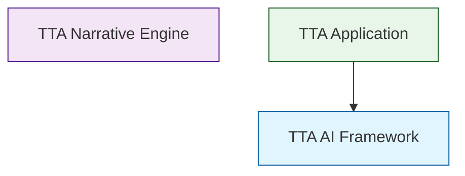

# [[TTA/Architecture/TTA Dependency Graph]]

## Package Dependencies



## Dependency Details

### TTA AI Framework (`tta-ai-framework`)
- **Purpose**: Reusable AI infrastructure
- **Components**: Agent orchestration, model management, prompt registry
- **Dependencies**: None (base package)

### TTA Narrative Engine (`tta-narrative-engine`)
- **Purpose**: Reusable narrative generation system
- **Components**: Scene generation, narrative orchestration, coherence validation
- **Dependencies**: TTA AI Framework

### TTA Application (`tta-app`)
- **Purpose**: TTA-specific application code
- **Components**: Player experience, API gateway, therapeutic systems
- **Dependencies**: TTA AI Framework, TTA Narrative Engine

## Analysis Report

```json
{
  "packages": [
    "tta-ai-framework",
    "tta-narrative-engine",
    "tta-app"
  ],
  "dependencies": {
    "tta-ai-framework": [
      "src",
      "tta_ai"
    ],
    "tta-narrative-engine": [],
    "tta-app": [
      "src",
      "tta_ai"
    ]
  },
  "summary": {
    "total_packages": 3,
    "total_dependencies": 4
  }
}
```

Generated: generate_dependency_graph.py


---
**Logseq:** [[TTA.dev/Platform_tta_dev/Components/Augment/Core/Kb/Tta___architecture___docs architecture dependency graph]]
