# [[TTA/Architecture/TTA System Architecture Diagram]]

## Overview
This diagram provides a comprehensive view of the TTA (Therapeutic Text Adventure) system architecture, showing all major components, services, databases, and their relationships.

## System Architecture

```mermaid
graph TB
    subgraph "Client Layer"
        WEB[Web Frontend<br/>React + TypeScript<br/>Port: 3000]
        MOBILE[Mobile App<br/>Future]
    end

    subgraph "API Gateway Layer"
        GATEWAY[API Gateway<br/>FastAPI<br/>Port: 8080]
        AUTH[Authentication Service<br/>JWT + OAuth]
        RATELIMIT[Rate Limiter]
        SECURITY[Security Scanner]
    end

    subgraph "Application Services"
        PLAYER[Player Experience API<br/>FastAPI]
        AGENT_ORCH[Agent Orchestration<br/>LangGraph]
        NARRATIVE[Narrative Engine<br/>Story Generation]
        GAMEPLAY[Gameplay Loop<br/>Turn-based System]
        THERAPEUTIC[Therapeutic Safety<br/>Content Validation]
    end

    subgraph "AI Agent Layer"
        WBA[World Builder Agent<br/>WBA]
        IPA[Input Processor Agent<br/>IPA]
        NGA[Narrative Generator Agent<br/>NGA]
        TGA[Therapeutic Guidance Agent<br/>TGA]
        CMA[Character Management Agent<br/>CMA]
    end

    subgraph "Data Layer"
        NEO4J[(Neo4j Graph DB<br/>Narrative State<br/>Relationships<br/>Ports: 7474, 7687)]
        REDIS[(Redis Cache<br/>Sessions<br/>Real-time Data<br/>Port: 6379)]
        POSTGRES[(PostgreSQL<br/>User Data<br/>Analytics<br/>Optional)]
    end

    subgraph "External Services"
        OPENROUTER[OpenRouter API<br/>LLM Provider]
        LOCAL_LLM[Local Models<br/>Fallback]
        MCP[MCP Servers<br/>Tool Integration]
    end

    subgraph "Monitoring & Observability"
        PROMETHEUS[Prometheus<br/>Metrics]
        GRAFANA[Grafana<br/>Dashboards]
        LOKI[Loki<br/>Logs]
        ALERTMANAGER[AlertManager<br/>Alerts]
    end

    %% Client to Gateway
    WEB -->|HTTPS/WSS| GATEWAY
    MOBILE -.->|Future| GATEWAY

    %% Gateway to Auth & Security
    GATEWAY --> AUTH
    GATEWAY --> RATELIMIT
    GATEWAY --> SECURITY

    %% Gateway to Application Services
    GATEWAY --> PLAYER
    GATEWAY --> AGENT_ORCH
    GATEWAY --> NARRATIVE
    GATEWAY --> GAMEPLAY
    GATEWAY --> THERAPEUTIC

    %% Application Services to AI Agents
    AGENT_ORCH --> WBA
    AGENT_ORCH --> IPA
    AGENT_ORCH --> NGA
    AGENT_ORCH --> TGA
    AGENT_ORCH --> CMA

    %% Services to Data Layer
    PLAYER --> NEO4J
    PLAYER --> REDIS
    PLAYER -.-> POSTGRES

    NARRATIVE --> NEO4J
    NARRATIVE --> REDIS

    GAMEPLAY --> NEO4J
    GAMEPLAY --> REDIS

    THERAPEUTIC --> REDIS

    AGENT_ORCH --> NEO4J
    AGENT_ORCH --> REDIS

    %% AI Agents to External Services
    WBA --> OPENROUTER
    IPA --> OPENROUTER
    NGA --> OPENROUTER
    TGA --> OPENROUTER
    CMA --> OPENROUTER

    WBA -.-> LOCAL_LLM
    NGA -.-> LOCAL_LLM

    AGENT_ORCH --> MCP

    %% Monitoring Connections
    GATEWAY -.->|Metrics| PROMETHEUS
    PLAYER -.->|Metrics| PROMETHEUS
    AGENT_ORCH -.->|Metrics| PROMETHEUS
    NARRATIVE -.->|Metrics| PROMETHEUS
    GAMEPLAY -.->|Metrics| PROMETHEUS

    PROMETHEUS --> GRAFANA
    PROMETHEUS --> ALERTMANAGER

    GATEWAY -.->|Logs| LOKI
    PLAYER -.->|Logs| LOKI
    AGENT_ORCH -.->|Logs| LOKI

    %% Styling
    classDef clientStyle fill:#e1f5ff,stroke:#01579b,stroke-width:2px
    classDef gatewayStyle fill:#fff3e0,stroke:#e65100,stroke-width:2px
    classDef serviceStyle fill:#f3e5f5,stroke:#4a148c,stroke-width:2px
    classDef agentStyle fill:#e8f5e9,stroke:#1b5e20,stroke-width:2px
    classDef dataStyle fill:#fce4ec,stroke:#880e4f,stroke-width:3px
    classDef externalStyle fill:#fff9c4,stroke:#f57f17,stroke-width:2px
    classDef monitorStyle fill:#e0f2f1,stroke:#004d40,stroke-width:2px

    class WEB,MOBILE clientStyle
    class GATEWAY,AUTH,RATELIMIT,SECURITY gatewayStyle
    class PLAYER,AGENT_ORCH,NARRATIVE,GAMEPLAY,THERAPEUTIC serviceStyle
    class WBA,IPA,NGA,TGA,CMA agentStyle
    class NEO4J,REDIS,POSTGRES dataStyle
    class OPENROUTER,LOCAL_LLM,MCP externalStyle
    class PROMETHEUS,GRAFANA,LOKI,ALERTMANAGER monitorStyle
```

## Component Descriptions

### Client Layer
- **Web Frontend**: React-based single-page application with TypeScript for type safety
- **Mobile App**: Future mobile application support (iOS/Android)

### API Gateway Layer
- **API Gateway**: Central entry point for all client requests, built with FastAPI
- **Authentication Service**: JWT-based authentication with OAuth support
- **Rate Limiter**: Intelligent traffic management with therapeutic prioritization
- **Security Scanner**: Content safety validation and security checks

### Application Services
- **Player Experience API**: User management, session handling, progress tracking
- **Agent Orchestration**: Multi-agent coordination using LangGraph workflows
- **Narrative Engine**: Story generation, character development, world management
- **Gameplay Loop**: Turn-based interaction system with choice processing
- **Therapeutic Safety**: Real-time content validation and emotional safety monitoring

### AI Agent Layer
- **World Builder Agent (WBA)**: Creates and manages game worlds and environments
- **Input Processor Agent (IPA)**: Processes and validates player input
- **Narrative Generator Agent (NGA)**: Generates narrative text and dialogue
- **Therapeutic Guidance Agent (TGA)**: Ensures therapeutic appropriateness
- **Character Management Agent (CMA)**: Manages character development and arcs

### Data Layer
- **Neo4j**: Graph database storing narrative structures, relationships, and world state
- **Redis**: High-performance cache for session management and real-time data
- **PostgreSQL**: Optional relational database for user data and analytics

### External Services
- **OpenRouter API**: Primary LLM provider for AI-powered content generation
- **Local Models**: Fallback local LLM support for offline scenarios
- **MCP Servers**: Model Context Protocol integration for extensible tools

### Monitoring & Observability
- **Prometheus**: Metrics collection and time-series database
- **Grafana**: Visualization dashboards for system monitoring
- **Loki**: Log aggregation and querying
- **AlertManager**: Alert routing and notification management

## Technology Stack

### Frontend
- React 18+ with TypeScript
- Redux Toolkit for state management
- Tailwind CSS for styling
- WebSocket for real-time communication

### Backend
- Python 3.11+ with FastAPI
- LangGraph for agent orchestration
- Pydantic for data validation
- AsyncIO for concurrent operations

### Databases
- Neo4j 5.x (Graph database)
- Redis 7.x (Cache and session store)
- PostgreSQL 15+ (Optional analytics)

### Infrastructure
- Docker & Docker Compose for containerization
- Kubernetes for production orchestration
- Nginx for reverse proxy and load balancing
- GitHub Actions for CI/CD

## Deployment Architecture

The system supports multiple deployment configurations:

1. **Development**: Docker Compose with all services on localhost
2. **Staging**: Kubernetes cluster with separate namespaces
3. **Production**: Multi-region Kubernetes with high availability
4. **Home Lab**: Self-hosted deployment for testing and validation

## Security Considerations

- **Authentication**: JWT tokens with automatic refresh and revocation
- **Authorization**: Role-based access control (RBAC) for all services
- **Encryption**: TLS/SSL for all external communications
- **Data Protection**: Encryption at rest for sensitive therapeutic data
- **Rate Limiting**: Per-user and per-endpoint rate limits
- **Content Validation**: Real-time therapeutic safety checks

## Scalability Features

- **Horizontal Scaling**: All services designed for horizontal scaling
- **Caching Strategy**: Multi-tier caching with Redis
- **Database Optimization**: Neo4j query optimization and indexing
- **Load Balancing**: Intelligent request distribution
- **Async Processing**: Non-blocking I/O for high concurrency

## Related Documentation

- [[TTA/Architecture/component-interaction-diagram|Component Interaction Diagram]]
- [[TTA/Architecture/data-flow-diagram|Data Flow Diagram]]
- [[TTA/Architecture/README|System Architecture Overview]]
- [[TTA/Architecture/technical-specifications|Technical Specifications]]

---
**Logseq:** [[TTA.dev/Platform_tta_dev/Components/Augment/Core/Kb/Tta___architecture___docs architecture system architecture diagram]]
